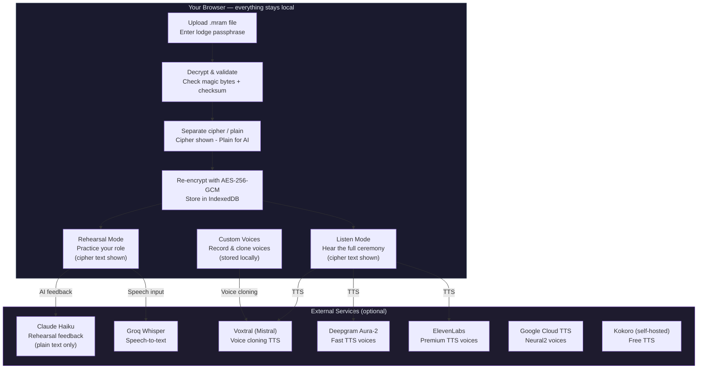

# Masonic Ritual Mentor

A privacy-first, voice-driven practice tool for Masonic ritual memorization. Load your encrypted ritual file (.mram), practice in multiple modes — solo drill, full-ceremony rehearsal, or listen-along — and get instant word-by-word feedback with AI coaching powered by Llama 3.3 on Groq.

**Live:** [masonic-ritual-ai-mentor.vercel.app](https://masonic-ritual-ai-mentor.vercel.app)

---

## How It Works


```mermaid
flowchart TB
    subgraph Browser["Your Browser — everything stays local"]
        Upload["Upload .mram file\nEnter lodge passphrase"]
        Decrypt["Decrypt & validate\nCheck magic bytes + checksum"]
        Split["Separate cipher / plain\nCipher shown - Plain for AI"]
        Encrypt["Re-encrypt with AES-256-GCM\nStore in IndexedDB"]
        Upload --> Decrypt --> Split --> Encrypt

        Listen["Listen Mode\nHear the full ceremony\n(cipher text shown)"]
        Rehearsal["Rehearsal Mode\nPractice your role\n(cipher text shown)"]
        Voices["Custom Voices\nRecord & clone voices\n(stored locally)"]
        Encrypt --> Listen
        Encrypt --> Rehearsal
    end

    subgraph External["External Services (optional)"]
        Claude["Claude Haiku\nRehearsal feedback\n(plain text only)"]
        Whisper["Groq Whisper\nSpeech-to-text"]
        Voxtral["Voxtral (Mistral)\nVoice cloning TTS"]
        Deepgram["Deepgram Aura-2\nFast TTS voices"]
        Eleven["ElevenLabs\nPremium TTS voices"]
        Google["Google Cloud TTS\nNeural2 voices"]
        Kokoro["Kokoro (self-hosted)\nFree TTS"]
    end

    Rehearsal -->|"AI feedback"| Claude
    Rehearsal -->|"Speech input"| Whisper
    Voices -->|"Voice cloning"| Voxtral
    Listen -->|"TTS"| Voxtral
    Listen -->|"TTS"| Deepgram
    Listen -->|"TTS"| Eleven

    style Browser fill:#1a1a2e,stroke:#334155,color:#e2e8f0
    style External fill:#1e1b2e,stroke:#4c1d95,color:#e2e8f0
```

---

## Features

### Rehearsal Mode
The main feature. Pick your officer role (WM, SW, JD, etc.), and the AI reads every other officer's lines with distinct voices. When it's your turn, you speak from memory and get instant accuracy feedback.

- AI reads other officers' lines with unique voices per role
- Auto-detects silence and advances when you finish speaking
- Line-by-line accuracy scoring with word-by-word diff
- Retry button to re-practice a line you got wrong
- Click any line in the script to jump to it

### Custom Voice Cloning
Record your own voice (or a brother's) on the **Voices** page. The app clones it via Voxtral and uses it for officer lines during rehearsal. Record multiple brothers for different officers.

- Record 3-10 seconds in the browser, or clone 7 Deepgram Aura voices instantly
- Converted to wav and stored locally in IndexedDB
- Sent as `ref_audio` with each Voxtral TTS request (zero-shot cloning)
- No Mistral paid plan required — works on the free tier
- Export/import voice profiles as JSON for backup and cross-device transfer
- Voice tone/speed/emotion matches how you recorded the sample

### Listen Mode
Hear the full ceremony read aloud with a unique AI voice for each officer. The script shows cipher text so you can follow along.

### Progress Tracking
Track your accuracy over time, see trends, identify persistent trouble spots, and celebrate streaks.

### Voice AI (6 TTS Engines)

| Engine | Type | Voices | Cost |
|--------|------|--------|------|
| **Voxtral (Mistral)** | Cloud + voice cloning | Clone any voice from 3s audio | ~$0.016/1K chars |
| **ElevenLabs** | Cloud | 10 distinct male voices | Premium |
| **Deepgram Aura-2** | Cloud | 7 distinct voices (Zeus, Orion, etc.) | Pay-per-use |
| **Google Cloud TTS** | Cloud | Neural2 voices with pitch control | Pay-per-use |
| **Kokoro** | Self-hosted | Multiple voices, free | Free (self-hosted) |
| **Browser** | Built-in | Pitch/rate differentiation | Free |

Each engine maps distinct voices to Masonic officer roles:

| Role | Officer | Voice Character |
|------|---------|----------------|
| WM | Worshipful Master | Deep, authoritative |
| SW | Senior Warden | Clear, measured |
| JW | Junior Warden | Mid-range, steady |
| SD | Senior Deacon | Smooth, warm |
| JD | Junior Deacon | Crisp, distinct |
| Chap | Chaplain | Reverent, steady |
| Sec | Secretary | Wise, mature |
| Tyler | Tyler | Laid-back, resonant |

### Speech-to-Text

| Engine | Details |
|--------|---------|
| **Groq Whisper** | Server-side, high accuracy, auto-silence detection, Masonic vocabulary hints |
| **Browser** | Built-in Web Speech API, works offline, no API key needed |

### Privacy & Security

- Ritual text is encrypted at rest with AES-256-GCM in IndexedDB
- Cipher and plain text stored in separate encrypted fields — never cross contexts
- Voice recordings stored locally in IndexedDB, only sent with TTS requests
- API keys stay server-side (Next.js API routes)
- Anthropic does not train on API data
- No user accounts or tracking
- .mram file is never stored — only re-encrypted data

---

## The .mram File Format

Ritual files use the `.mram` (Masonic Ritual AI Mentor) encrypted format. Each file bundles **cipher text** (abbreviated/encoded) and **plain text** (full English) for every line, encrypted with a lodge passphrase.

**Key principle: cipher and plain text never cross contexts.**
- **Cipher text** is shown to the user in all practice modes
- **Plain text** is used only for AI feedback, accuracy comparison, and TTS

### Building .mram Files

```bash
npx tsx scripts/build-mram.ts <input.md> <output.mram> [passphrase] [options]
```

**Options:**

| Flag | Description |
|------|-------------|
| `--expires <ISO-date>` | Hard expiration timestamp (e.g. `2026-12-31` or `2026-12-31T23:59:59Z`). After this moment the file will not decrypt, even with the correct passphrase. |
| `--expires-in <duration>` | Relative expiration from build time. Supports `d` (days), `h` (hours), `m` (minutes): `90d`, `72h`, `45m`. |

The expiration timestamp lives inside the encrypted payload and is covered by the AES-GCM auth tag, so it cannot be edited without the lodge passphrase. Expired files show a specific "request a fresh .mram file from your lodge" message on upload instead of a passphrase retry. Files built without an `--expires*` flag never expire — the feature is opt-in.

Input format: a markdown file where each spoken line appears twice — cipher first, then plain:

```markdown
### Section Title

WM: * Bro. S.W., p. t. s. y. t. a. p. a. M.
WM: * Brother Senior Warden, proceed to satisfy yourself that all present are Masons.

SW: * Bros. S. & J.D., p. t. s. y. t. a. p. a. M.
SW: * Brothers Senior & Junior Deacons, proceed to satisfy yourselves that all present are Masons.
```

### Rotating .mram Files (new passphrase or new expiry)

When a .mram file expires or the lodge passphrase is being changed, `rotate-mram.ts` re-encrypts an existing file with a new passphrase and/or new expiry. It generates a fresh salt and IV every rotation.

```bash
npx tsx scripts/rotate-mram.ts <input.mram> <output.mram> [options]
```

**Options:**

| Flag | Description |
|------|-------------|
| `--old-pass <pass>` | Current passphrase (prompted if omitted). |
| `--new-pass <pass>` | New passphrase (prompted if omitted). |
| `--expires <ISO-date>` | Set a new hard expiration timestamp. |
| `--expires-in <duration>` | Set a new expiration relative to now: `90d`, `72h`, `45m`. |
| `--no-expires` | Remove the `expiresAt` field entirely. |
| `--keep-expires` | Keep the existing `expiresAt` value (default). |

Exactly one expiry flag may be passed. Rotation intentionally bypasses the expiration check on read — reissuing an already-expired file is the main use case — and logs the previous expiry status so the operator sees what was unlocked. Input and output paths must differ so a crash mid-rotate cannot destroy the original.

---

## Tech Stack

| Layer | Technology |
|-------|-----------|
| Frontend | Next.js 16 (App Router), React 19, TypeScript |
| Styling | Tailwind CSS v4 |
| AI Feedback | Llama 3.3 on Groq (streaming) |
| Speech-to-Text | Groq Whisper (server-side) + Browser Web Speech API |
| Text-to-Speech | Voxtral, ElevenLabs, Deepgram Aura-2, Google Cloud TTS, Kokoro, Browser |
| Voice Cloning | Voxtral (Mistral) via ref_audio zero-shot cloning |
| Text Comparison | jsdiff + Double Metaphone + Levenshtein distance |
| Ritual Format | .mram encrypted binary (AES-256-GCM + PBKDF2) |
| Audio Synthesis | Web Audio API (gavel knock sounds, wav conversion) |
| Storage | IndexedDB with Web Crypto API (AES-256-GCM) |
| Deployment | Vercel |

---

## Architecture

```
src/
├── app/
│   ├── api/
│   │   ├── rehearsal-feedback/route.ts  # Llama 3.3 streaming feedback
│   │   ├── transcribe/route.ts          # Groq Whisper STT proxy
│   │   └── tts/
│   │       ├── voxtral/
│   │       │   ├── route.ts             # Voxtral TTS proxy (voice_id or ref_audio)
│   │       │   ├── voices/route.ts      # List/create Mistral voice profiles
│   │       │   ├── clone-aura/route.ts  # Generate Deepgram samples for local cloning
│   │       │   └── setup/route.ts       # Bootstrap voices from Deepgram/ElevenLabs
│   │       ├── elevenlabs/route.ts      # ElevenLabs TTS proxy
│   │       ├── deepgram/route.ts        # Deepgram Aura-2 TTS proxy
│   │       ├── google/route.ts          # Google Cloud TTS proxy
│   │       ├── kokoro/route.ts          # Kokoro self-hosted TTS proxy
│   │       └── engines/route.ts         # TTS engine availability check
│   ├── voices/page.tsx                  # Voice recording & management
│   ├── practice/page.tsx                # Practice mode (solo + rehearsal + listen)
│   ├── progress/page.tsx                # Performance tracking dashboard
│   ├── upload/page.tsx                  # .mram file upload page
│   ├── walkthrough/page.tsx             # Visual how-it-works guide
│   ├── layout.tsx                       # Root layout with Navigation
│   ├── page.tsx                         # Home page
│   └── middleware.ts                    # Redirects / to landing page
├── components/
│   ├── DiffDisplay.tsx                  # Color-coded word-by-word diff
│   ├── DocumentUpload.tsx               # .mram file upload + passphrase entry
│   ├── ListenMode.tsx                   # Full ceremony playback with TTS
│   ├── Navigation.tsx                   # Mobile bottom bar + desktop top nav
│   ├── PerformanceTracker.tsx           # Accuracy trends & streaks
│   ├── PracticeMode.tsx                 # Solo section practice
│   ├── RehearsalMode.tsx                # Call-and-response with AI voices
│   └── TTSEngineSelector.tsx            # Voice engine selection dropdown
├── middleware.ts                         # Root redirect to Pretext landing page
└── lib/
    ├── default-voices.ts                # Pre-baked Aura-2 voice loader (7 male voices)
    ├── voice-storage.ts                 # IndexedDB storage + export/import for voice recordings
    ├── audio-utils.ts                   # WAV encoding + audio normalization
    ├── tts-cloud.ts                     # Cloud TTS engines + voice role mapping
    ├── text-to-speech.ts                # TTS engine abstraction + routing
    ├── speech-to-text.ts                # STT engines (Whisper + Browser)
    ├── text-comparison.ts               # 5-layer comparison pipeline
    ├── mram-format.ts                   # .mram encrypt/decrypt/conversion
    ├── storage.ts                       # Encrypted IndexedDB (v3: + voices store)
    ├── performance-history.ts           # Practice session history tracking
    ├── document-parser.ts               # Role display names + text parsing
    └── gavel-sound.ts                   # Synthesized gavel knock via Web Audio

public/
├── landing.html                         # Pretext-powered interactive landing page
├── pretext.js                           # Vendored Pretext library (30KB)
└── voices/                              # Pre-baked default voice samples (7 male Aura-2)

scripts/
├── build-mram.ts                        # CLI: build .mram files from paired markdown
└── benchmark-tts.ts                     # TTS engine benchmark (TTFB + total response time)
```

---

## Getting Started

### Prerequisites

- Node.js 18+
- A Groq API key (for AI rehearsal feedback and speech-to-text)
- A `.mram` ritual file from your lodge (encrypted with a lodge passphrase)

### Installation

```bash
npm install
cp .env.example .env
```

Add your API keys to `.env`:

```bash
# Required — AI feedback + speech-to-text
GROQ_API_KEY=                    # Llama 3.3 feedback + Whisper STT

# Pick one or more TTS engines
MISTRAL_API_KEY=                 # Voxtral — voice cloning, half-cost
DEEPGRAM_API_KEY=                # Aura-2 — fast, natural
ELEVENLABS_API_KEY=              # Premium — ultra-realistic
GOOGLE_CLOUD_TTS_API_KEY=        # Neural2 voices
KOKORO_TTS_URL=                  # Self-hosted, free
```

```bash
npm run dev
```

Open [http://localhost:3000](http://localhost:3000).

### Setting Up Custom Voice Cloning

1. Set `MISTRAL_API_KEY` in your environment
2. Go to the **Voices** page in the app
3. Record yourself reading a ritual phrase (3-10 seconds)
4. Name it (e.g. "Brother McLeod - WM") and save
5. Select **Voxtral (Mistral)** in the TTS engine dropdown
6. Start rehearsal — the AI speaks in your cloned voice

Record multiple brothers with different tones for different officers. The app distributes voices across roles automatically.

### Usage

1. **Upload** your .mram encrypted ritual file and enter your lodge passphrase
2. **Rehearsal Mode** — Pick your role; the AI reads other officers' lines, then prompts you for yours
3. **Listen Mode** — Hear the full ceremony read aloud with unique officer voices
4. **Voices** — Record voice samples for Voxtral voice cloning
5. **Progress** — Track accuracy trends and identify trouble spots

---

## Deploying

Deploy to Vercel:

```bash
npm run build
```

Set your environment variables in Vercel project settings. At minimum: `GROQ_API_KEY`. Add TTS keys as desired.

---

## How This App Was Built

This app was built almost entirely with AI. One human (a Freemason who wanted a better way to practice ritual) plus AI coding assistants, from first commit to production in about 6 weeks.

### The Human

Shannon McLeod, a Freemason who got tired of practicing ritual by reading from a book. The idea: what if you could rehearse the way actors do, with someone reading the other parts back to you in distinct voices, and getting instant feedback on what you got wrong?

### The AI Stack (Development)

| Tool | Role |
|------|------|
| **Claude Code (Anthropic)** | Primary development environment. Wrote ~80% of the code, designed the architecture, ran the test suite, created PRs, and did code review. Used Claude Opus 4.6 (1M context). |
| **Claude Sonnet 4.6** | Used within Claude Code for faster subagent tasks: exploring the codebase, pre-landing code review, adversarial review passes. |
| **gstack** | Open source AI builder framework (by Garry Tan). Provided structured workflows for shipping: `/design-review` for visual audits, `/ship` for automated PR creation with tests, `/document-release` for keeping docs current. |

### The AI Stack (Runtime)

| Service | What It Does | Model |
|---------|-------------|-------|
| **Groq** | AI rehearsal feedback (tells you what you got right/wrong) | Llama 3.3 70B |
| **Groq** | Speech-to-text (transcribes your spoken ritual) | Whisper Large v3 |
| **Mistral** | Voice cloning TTS (clones a brother's voice from 3s of audio) | Voxtral Mini TTS |
| **Deepgram** | Fast TTS voices for officer roles | Aura-2 (Zeus, Orion, Arcas, etc.) |
| **Google Cloud** | Neural TTS with pitch/rate control per officer | Neural2 voices |

### The Human Stack (Runtime)

| Technology | What It Does |
|-----------|-------------|
| **Next.js 16** | App Router, React 19, TypeScript |
| **Tailwind CSS v4** | Styling (dark Masonic theme with Cinzel + Lato fonts) |
| **IndexedDB** | Client-side encrypted storage for ritual text and voice profiles |
| **Web Crypto API** | AES-256-GCM encryption for ritual data at rest |
| **Web Audio API** | Gavel knock synthesis, audio normalization, WAV encoding |
| **Pretext** | Interactive landing page with real-time text reflow (chenglou/pretext) |
| **Vercel** | Hosting and deployment |

### Build Timeline

- **Feb 17, 2026** — First commit. MVP: upload a ritual file, practice speaking, get basic accuracy feedback.
- **Feb-Mar 2026** — Added 6 TTS engines, rehearsal mode with multi-officer voices, voice cloning, listen mode, performance tracking.
- **Mar 2026** — Switched AI feedback from Claude Haiku to Llama 3.3 on Groq (faster, free tier). Added Voxtral voice cloning. Reduced TTS latency with streaming.
- **Apr 2026** — Design review (C+ → B+ design score), mobile-first redesign, voice export/import, TTS benchmark tooling, dead voice model cleanup. Pretext-powered interactive landing page with Masonic symbols and real-time text reflow. Pre-baked default voices (7 male Aura-2). Feedback voice selector in rehearsal mode.

### By the Numbers

- **~169 commits** across the project
- **67 automated tests** (Vitest)
- **6 TTS engines** supported (Voxtral, Deepgram, ElevenLabs, Google, Kokoro, Browser)
- **5-layer text comparison** (normalization, word diff, phonetic, fuzzy, scoring)
- **0 user accounts required** — everything stays in your browser
