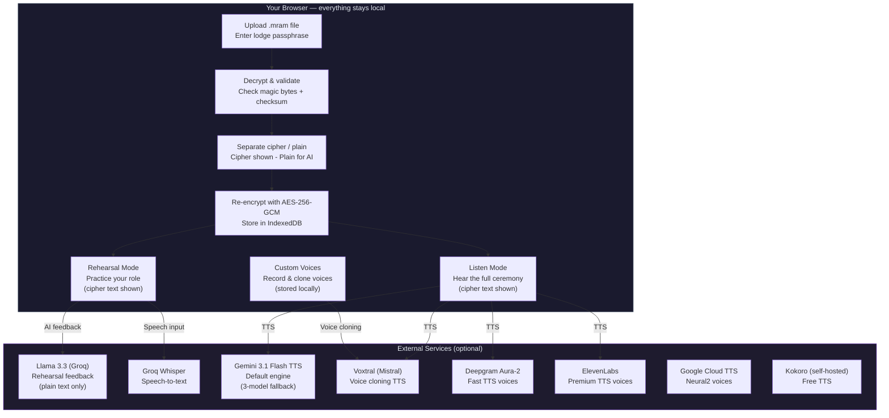

# Masonic Ritual Mentor

A privacy-first, voice-driven practice tool for Masonic ritual memorization. Load your encrypted ritual file (.mram), practice in multiple modes — solo drill, full-ceremony rehearsal, or listen-along — and get instant word-by-word feedback with AI coaching powered by Llama 3.3 on Groq.

**Live:** [masonic-ritual-ai-mentor.vercel.app](https://masonic-ritual-ai-mentor.vercel.app)

---

## How It Works


```mermaid
flowchart TB
    subgraph Browser["Your Browser — everything stays local"]
        Upload["Upload .mram file\nEnter lodge passphrase"]
        Decrypt["Decrypt & validate\nCheck magic bytes + checksum"]
        Split["Separate cipher / plain\nCipher shown - Plain for AI"]
        Encrypt["Re-encrypt with AES-256-GCM\nStore in IndexedDB"]
        Upload --> Decrypt --> Split --> Encrypt

        Listen["Listen Mode\nHear the full ceremony\n(cipher text shown)"]
        Rehearsal["Rehearsal Mode\nPractice your role\n(cipher text shown)"]
        Voices["Custom Voices\nRecord & clone voices\n(stored locally)"]
        Encrypt --> Listen
        Encrypt --> Rehearsal
    end

    subgraph External["External Services (optional)"]
        Llama["Llama 3.3 (Groq)\nRehearsal feedback\n(plain text only)"]
        Whisper["Groq Whisper\nSpeech-to-text"]
        Gemini["Gemini 3.1 Flash TTS\nDefault engine\n(3-model fallback)"]
        Voxtral["Voxtral (Mistral)\nVoice cloning TTS"]
        Deepgram["Deepgram Aura-2\nFast TTS voices"]
        Eleven["ElevenLabs\nPremium TTS voices"]
        Google["Google Cloud TTS\nNeural2 voices"]
        Kokoro["Kokoro (self-hosted)\nFree TTS"]
    end

    Rehearsal -->|"AI feedback"| Llama
    Rehearsal -->|"Speech input"| Whisper
    Voices -->|"Voice cloning"| Voxtral
    Listen -->|"TTS"| Gemini
    Listen -->|"TTS"| Voxtral
    Listen -->|"TTS"| Deepgram
    Listen -->|"TTS"| Eleven

    style Browser fill:#1a1a2e,stroke:#334155,color:#e2e8f0
    style External fill:#1e1b2e,stroke:#4c1d95,color:#e2e8f0
```

---

## Features

### Rehearsal Mode
The main feature. Pick your officer role (WM, SW, JD, etc.), and the AI reads every other officer's lines with distinct voices. When it's your turn, you speak from memory and get instant accuracy feedback.

- AI reads other officers' lines with unique voices per role
- Auto-detects silence and advances when you finish speaking
- Line-by-line accuracy scoring with word-by-word diff
- Retry button to re-practice a line you got wrong
- Click any line in the script to jump to it

### Custom Voice Cloning
Record your own voice (or a brother's) on the **Voices** page. The app clones it via Voxtral and uses it for officer lines during rehearsal. Record multiple brothers for different officers.

- Record 3-10 seconds in the browser, or clone 7 Deepgram Aura voices instantly
- Converted to wav and stored locally in IndexedDB
- Sent as `ref_audio` with each Voxtral TTS request (zero-shot cloning)
- No Mistral paid plan required — works on the free tier
- Export/import voice profiles as JSON for backup and cross-device transfer
- Voice tone/speed/emotion matches how you recorded the sample

### Listen Mode
Hear the full ceremony read aloud with a unique AI voice for each officer. The script shows cipher text so you can follow along.

### Progress Tracking
Track your accuracy over time, see trends, identify persistent trouble spots, and celebrate streaks.

### Voice AI (7 TTS Engines)

| Engine | Type | Voices | Cost |
|--------|------|--------|------|
| **Gemini 3.1 Flash TTS** *(default)* | Cloud, expressive | Per-role male voices (Alnilam, Charon, Algenib, Fenrir, etc.) with prompt-tag direction | Preview pricing |
| **Voxtral (Mistral)** | Cloud + voice cloning | Clone any voice from 3s audio; 15 default character voices ship in the pool | ~$0.016/1K chars |
| **ElevenLabs** | Cloud | 10 distinct male voices | Premium |
| **Deepgram Aura-2** | Cloud | 7 distinct voices (Zeus, Orion, etc.) | Pay-per-use |
| **Google Cloud TTS** | Cloud | Neural2 voices with pitch control | Pay-per-use |
| **Kokoro** | Self-hosted | Multiple voices, free | Free (self-hosted) |
| **Browser** | Built-in | Pitch/rate differentiation | Free |

Gemini is the default engine. When Gemini hits its preview-tier daily quota, the route silently falls back across `gemini-3.1-flash-tts-preview` → `gemini-2.5-flash-preview-tts` → `gemini-2.5-pro-preview-tts`. If all three Gemini models are throttled, the client falls back to Voxtral (drawing from the 15 default character voices) → Google Cloud Neural2 → browser TTS.

Each engine maps distinct voices to Masonic officer roles:

| Role | Officer | Voice Character |
|------|---------|----------------|
| WM | Worshipful Master | Deep, authoritative |
| SW | Senior Warden | Clear, measured |
| JW | Junior Warden | Mid-range, steady |
| SD | Senior Deacon | Smooth, warm |
| JD | Junior Deacon | Crisp, distinct |
| Chap | Chaplain | Reverent, steady |
| Sec | Secretary | Wise, mature |
| Tyler | Tyler | Laid-back, resonant |

### Speech-to-Text

| Engine | Details |
|--------|---------|
| **Groq Whisper** | Server-side, high accuracy, auto-silence detection, Masonic vocabulary hints |
| **Browser** | Built-in Web Speech API, works offline, no API key needed |

### Privacy & Security

- Ritual text is encrypted at rest with AES-256-GCM in IndexedDB
- Cipher and plain text stored in separate encrypted fields — never cross contexts
- Voice recordings stored locally in IndexedDB, only sent with TTS requests
- API keys stay server-side (Next.js API routes)
- Anthropic does not train on API data
- .mram file is never stored — only re-encrypted data
- **Pilot allowlist + magic-link auth** — only emails on `LODGE_ALLOWLIST` get sign-in links; no passwords, no accounts beyond a session cookie
- **Per-IP and per-email rate limiting** on magic-link issuance (5/hr per IP, 3/hr per email) using `x-vercel-forwarded-for` for trustworthy IP attribution
- **Strict CSP + security headers** on every response (`X-Frame-Options: DENY`, `frame-ancestors 'none'`, locked `Permissions-Policy`, HSTS preload)

---

## The .mram File Format

Ritual files use the `.mram` (Masonic Ritual AI Mentor) encrypted format. Each file bundles **cipher text** (abbreviated/encoded) and **plain text** (full English) for every line, encrypted with a lodge passphrase.

**Key principle: cipher and plain text never cross contexts.**
- **Cipher text** is shown to the user in all practice modes
- **Plain text** is used only for AI feedback, accuracy comparison, and TTS

### Building .mram Files

Two build scripts. `build-mram-from-dialogue.ts` is the current recommended path:

```bash
npx tsx scripts/build-mram-from-dialogue.ts \
  rituals/{prefix}-dialogue.md \
  rituals/{prefix}-dialogue-cipher.md \
  rituals/{prefix}.mram
```

It reads two parallel dialogue files (plain + cipher) with matching speaker structure, plus an optional `{prefix}-styles.json` sidecar with per-line Gemini style tags. Passphrase is prompted interactively (never accepted on the command line).

**With pre-rendered audio (recommended for pilot distribution):**

```bash
GOOGLE_GEMINI_API_KEY=... \
npx tsx scripts/build-mram-from-dialogue.ts \
  rituals/ea-initiation-dialogue.md \
  rituals/ea-initiation-dialogue-cipher.md \
  rituals/ea-initiation.mram \
  --with-audio
```

`--with-audio` renders every spoken line to Opus (32 kbps mono) via Gemini 3.1 Flash TTS using the canonical `GEMINI_ROLE_VOICES` cast, and embeds the audio in the encrypted .mram payload. At playback time, the client plays these bytes directly — **zero Gemini API calls per Brother per rehearsal, ever**. File grows from ~50 KB to ~6 MB per ritual.

Requirements:
- `ffmpeg` in PATH (for Opus encoding)
- `GOOGLE_GEMINI_API_KEY` env var
- Your own quota (the script uses the same 3-model fallback chain as the app: 3.1-flash → 2.5-flash → 2.5-pro; on all-models-429 it sleeps until midnight PT and auto-resumes)

Per-line Opus bytes are cached at `~/.cache/masonic-mram-audio/` so interrupted runs resume cleanly. A 150-line ritual takes ~13 minutes end-to-end when the full chain is available.

**Quality-tier consistency (`--on-fallback`):** If 3.1-flash runs out of quota mid-ritual, the bake normally falls back to the 2.5-flash / 2.5-pro tier silently. Mixing tiers inside one ritual produces audibly inconsistent voice quality line-to-line, so the build script detects the first fallback and acts based on `--on-fallback`:

```bash
# Default: prompt once on first fallback (interactive)
npx tsx scripts/build-mram-from-dialogue.ts <plain> <cipher> <out> --with-audio

# Abort immediately on any fallback (exit code 2, cache preserved)
npx tsx scripts/build-mram-from-dialogue.ts <plain> <cipher> <out> --with-audio --on-fallback=abort

# Keep going on the lower tier without prompting (good for CI)
npx tsx scripts/build-mram-from-dialogue.ts <plain> <cipher> <out> --with-audio --on-fallback=continue
```

**On abort, the contaminated cache entry is removed.** The line that was just rendered on the fallback tier gets its cache file deleted before exit, so when you re-run after midnight PT:

- All lines rendered on the preferred tier before the drop → cache hits, zero API cost
- The triggering line → fresh render on the preferred tier
- All subsequent lines → fresh render on the preferred tier

Result: uniform premium bake, paying only for the unrendered lines on your next run.

The final summary prints a per-model tally so you can see exactly how many lines each model served:

```
Audio bake complete:
  Rendered via API:  150
    Per-model breakdown:
      gemini-3.1-flash-tts-preview        120 lines  (preferred)
      gemini-2.5-flash-preview-tts         30 lines  (fallback)
  Cache hits:        0
```

**Convenience wrapper for the full EA degree:**

```bash
GOOGLE_GEMINI_API_KEY=... npx tsx scripts/bake-ea-rituals.ts [--on-fallback=ask|continue|abort]
```

Runs ea-opening, ea-initiation, and ea-closing back-to-back with a single passphrase prompt. Skips any ritual whose source dialogue files aren't present. Use `BAKE_SKIP=ea-closing` to exclude specific rituals. `--on-fallback` is passed through to each child build — if you choose abort (or the default prompt picks abort), the wrapper halts the whole sequence rather than producing a degraded second/third ritual. Total wall time ~25-30 minutes when the cache is cold; near-instant when fully cached.

Legacy `build-mram.ts` (single-file paired format) still works for older ritual sources.

---

## Tech Stack

| Layer | Technology |
|-------|-----------|
| Frontend | Next.js 16 (App Router), React 19, TypeScript |
| Styling | Tailwind CSS v4 |
| AI Feedback | Llama 3.3 on Groq (streaming) |
| Speech-to-Text | Groq Whisper (server-side) + Browser Web Speech API |
| Text-to-Speech | Gemini 3.1 Flash TTS (default), Voxtral, ElevenLabs, Deepgram Aura-2, Google Cloud TTS, Kokoro, Browser |
| Voice Cloning | Voxtral (Mistral) via ref_audio zero-shot cloning |
| Text Comparison | jsdiff + Double Metaphone + Levenshtein distance |
| Ritual Format | .mram encrypted binary (AES-256-GCM + PBKDF2) |
| Audio Synthesis | Web Audio API (gavel knock sounds, wav conversion) |
| Storage | IndexedDB with Web Crypto API (AES-256-GCM) |
| Deployment | Vercel |

---

## Architecture

```
src/
├── app/
│   ├── api/
│   │   ├── auth/magic-link/
│   │   │   ├── request/route.ts         # Issue magic-link (per-IP/per-email rate limit)
│   │   │   └── verify/route.ts          # Verify token, set session cookie
│   │   ├── author/                      # Local-only ritual review tool API
│   │   │   ├── _guard.ts                # Loopback / dev-only access guard
│   │   │   ├── list/route.ts            # List dialogue + cipher pairs in rituals/
│   │   │   ├── pair/route.ts            # GET/POST a plain+cipher pair with validation
│   │   │   ├── mram/route.ts            # Build encrypted .mram from a pair
│   │   │   ├── pair/route.ts            # Atomic write-back + re-validation
│   │   │   └── suggest-styles/route.ts  # Per-line LLM style suggestions
│   │   ├── rehearsal-feedback/route.ts  # Llama 3.3 streaming feedback
│   │   ├── transcribe/route.ts          # Groq Whisper STT proxy
│   │   └── tts/
│   │       ├── gemini/route.ts          # Gemini 3.1 Flash TTS — default engine, 3-model fallback chain
│   │       ├── voxtral/
│   │       │   ├── route.ts             # Voxtral TTS proxy (voice_id or ref_audio)
│   │       │   ├── voices/route.ts      # List/create Mistral voice profiles
│   │       │   ├── clone-aura/route.ts  # Generate Deepgram samples for local cloning
│   │       │   └── setup/route.ts       # Bootstrap voices from Deepgram/ElevenLabs
│   │       ├── elevenlabs/route.ts      # ElevenLabs TTS proxy
│   │       ├── deepgram/route.ts        # Deepgram Aura-2 TTS proxy
│   │       ├── google/route.ts          # Google Cloud TTS proxy
│   │       ├── kokoro/route.ts          # Kokoro self-hosted TTS proxy
│   │       └── engines/route.ts         # TTS engine availability check
│   ├── author/page.tsx                  # Local-only side-by-side ritual editor (dev-only)
│   ├── voices/page.tsx                  # Voice recording & management
│   ├── practice/page.tsx                # Practice mode (solo + rehearsal + listen)
│   ├── progress/page.tsx                # Performance tracking dashboard
│   ├── upload/page.tsx                  # .mram file upload page
│   ├── walkthrough/page.tsx             # Visual how-it-works guide
│   ├── signin/page.tsx                  # Magic-link sign-in page (pilot allowlist)
│   ├── layout.tsx                       # Root layout with Navigation
│   ├── page.tsx                         # Home page
│   └── middleware.ts                    # Redirects / to landing page
├── components/
│   ├── DiffDisplay.tsx                  # Color-coded word-by-word diff
│   ├── DocumentUpload.tsx               # .mram file upload + passphrase entry
│   ├── GeminiPreloadPanel.tsx           # Gemini per-ritual audio preload + cache probe
│   ├── ListenMode.tsx                   # Full ceremony playback with TTS
│   ├── Navigation.tsx                   # Mobile bottom bar + desktop top nav
│   ├── PerformanceTracker.tsx           # Accuracy trends & streaks
│   ├── PracticeMode.tsx                 # Solo section practice
│   ├── RehearsalMode.tsx                # Call-and-response with AI voices
│   └── TTSEngineSelector.tsx            # Voice engine selection dropdown
├── middleware.ts                         # Root redirect + auth gate + CORS + shared-secret check
└── lib/
    ├── auth.ts                          # JWT magic-link tokens + session cookie
    ├── rate-limit.ts                    # In-memory sliding-window limiter (Vercel-trusted IP)
    ├── default-voices.ts                # 15 default Voxtral voices (unassigned, fallback pool)
    ├── voice-storage.ts                 # IndexedDB voices store + audioCache for Gemini output
    ├── audio-utils.ts                   # WAV encoding + audio normalization
    ├── tts-cloud.ts                     # Cloud TTS engines + voice role mapping + Gemini cache
    ├── text-to-speech.ts                # TTS engine abstraction + routing (Gemini default)
    ├── speech-to-text.ts                # STT engines (Whisper + Browser)
    ├── text-comparison.ts               # 5-layer comparison pipeline
    ├── mram-format.ts                   # .mram encrypt/decrypt/conversion
    ├── storage.ts                       # Encrypted IndexedDB (v4: + audioCache store)
    ├── styles.ts                        # Per-line style tag schema (Gemini prompt-tags)
    ├── dialogue-format.ts               # Parse paired plain+cipher dialogue files
    ├── dialogue-to-mram.ts              # Compile dialogue + styles into MRAMDocument
    ├── author-validation.ts             # Shared client/server validation for /author
    ├── performance-history.ts           # Practice session history tracking
    ├── document-parser.ts               # Role display names + text parsing
    └── gavel-sound.ts                   # Synthesized gavel knock via Web Audio

public/
├── landing.html                         # Pretext-powered interactive landing page
├── pretext.js                           # Vendored Pretext library (30KB)
└── voices/                              # 15 default Voxtral voices (8 character + 7 Aura-2)

rituals/                                  # Local-only — ritual source files (.mram gitignored)
├── {prefix}-dialogue.md                 # Plain-text dialogue
├── {prefix}-dialogue-cipher.md          # Cipher-text dialogue (parallel structure)
├── {prefix}-styles.json                 # Per-line Gemini style tags (optional)
└── {prefix}.mram                        # Built encrypted artifact (local-only, never committed)

scripts/
├── build-mram.ts                        # CLI: build .mram files from paired markdown
├── build-mram-from-dialogue.ts          # CLI: build .mram from dialogue + cipher + styles + optional pre-rendered Gemini audio
├── bake-ea-rituals.ts                   # CLI: bake all 3 EA rituals back-to-back with one passphrase prompt
├── render-gemini-audio.ts               # Opus rendering pipeline (Gemini SSE → ffmpeg → cache)
└── benchmark-tts.ts                     # TTS engine benchmark (TTFB + total response time)
```

---

## Getting Started

### Prerequisites

- Node.js 18+
- A Groq API key (for AI rehearsal feedback and speech-to-text)
- A `.mram` ritual file from your lodge (encrypted with a lodge passphrase)

### Installation

```bash
npm install
cp .env.example .env
```

Add your API keys to `.env`:

```bash
# Required — AI feedback + speech-to-text
GROQ_API_KEY=                    # Llama 3.3 feedback + Whisper STT

# TTS engines — Gemini is the default; rest are fallbacks or alternatives
GOOGLE_GEMINI_API_KEY=           # Gemini 3.1 Flash TTS — default playback engine
GEMINI_TTS_MODELS=               # Optional: comma-separated override of model fallback chain
MISTRAL_API_KEY=                 # Voxtral — voice cloning, half-cost
DEEPGRAM_API_KEY=                # Aura-2 — fast, natural
ELEVENLABS_API_KEY=              # Premium — ultra-realistic
GOOGLE_CLOUD_TTS_API_KEY=        # Neural2 voices
KOKORO_TTS_URL=                  # Self-hosted, free

# Pilot auth (optional — only set if running an allowlisted pilot)
LODGE_ALLOWLIST=                 # Comma-separated emails allowed to sign in
RESEND_API_KEY=                  # Email provider for magic-link delivery
MAGIC_LINK_FROM_EMAIL=           # From: address for magic-link emails
MAGIC_LINK_BASE_URL=             # Base URL for magic-link callbacks (defaults to request origin)
```

```bash
npm run dev
```

Open [http://localhost:3000](http://localhost:3000).

### Setting Up Custom Voice Cloning

1. Set `MISTRAL_API_KEY` in your environment
2. Go to the **Voices** page in the app
3. Record yourself reading a ritual phrase (3-10 seconds)
4. Name it (e.g. "Brother McLeod - WM") and save
5. Select **Voxtral (Mistral)** in the TTS engine dropdown
6. Start rehearsal — the AI speaks in your cloned voice

Record multiple brothers with different tones for different officers. The app distributes voices across roles automatically.

### Usage

1. **Upload** your .mram encrypted ritual file and enter your lodge passphrase
2. **Rehearsal Mode** — Pick your role; the AI reads other officers' lines, then prompts you for yours
3. **Listen Mode** — Hear the full ceremony read aloud with unique officer voices
4. **Voices** — Record voice samples for Voxtral voice cloning
5. **Progress** — Track accuracy trends and identify trouble spots

---

## Deploying

Deploy to Vercel:

```bash
npm run build
```

Set your environment variables in Vercel project settings. At minimum: `GROQ_API_KEY`. Add TTS keys as desired.

---

## How This App Was Built

This app was built almost entirely with AI. One human (a Freemason who wanted a better way to practice ritual) plus AI coding assistants, from first commit to production in about 6 weeks.

### The Human

Shannon McLeod, a Freemason who got tired of practicing ritual by reading from a book. The idea: what if you could rehearse the way actors do, with someone reading the other parts back to you in distinct voices, and getting instant feedback on what you got wrong?

### The AI Stack (Development)

| Tool | Role |
|------|------|
| **Claude Code (Anthropic)** | Primary development environment. Wrote ~80% of the code, designed the architecture, ran the test suite, created PRs, and did code review. Used Claude Opus 4.6 (1M context). |
| **Claude Sonnet 4.6** | Used within Claude Code for faster subagent tasks: exploring the codebase, pre-landing code review, adversarial review passes. |
| **gstack** | Open source AI builder framework (by Garry Tan). Provided structured workflows for shipping: `/design-review` for visual audits, `/ship` for automated PR creation with tests, `/document-release` for keeping docs current. |

### The AI Stack (Runtime)

| Service | What It Does | Model |
|---------|-------------|-------|
| **Google** | Default TTS (per-role male voices with prompt-tag direction) | Gemini 3.1 Flash TTS (preview) |
| **Groq** | AI rehearsal feedback (tells you what you got right/wrong) | Llama 3.3 70B |
| **Groq** | Speech-to-text (transcribes your spoken ritual) | Whisper Large v3 |
| **Mistral** | Voice cloning TTS (clones a brother's voice from 3s of audio) | Voxtral Mini TTS |
| **Deepgram** | Fast TTS voices for officer roles | Aura-2 (Zeus, Orion, Arcas, etc.) |
| **Google Cloud** | Neural TTS with pitch/rate control per officer | Neural2 voices |

### The Human Stack (Runtime)

| Technology | What It Does |
|-----------|-------------|
| **Next.js 16** | App Router, React 19, TypeScript |
| **Tailwind CSS v4** | Styling (dark Masonic theme with Cinzel + Lato fonts) |
| **IndexedDB** | Client-side encrypted storage for ritual text and voice profiles |
| **Web Crypto API** | AES-256-GCM encryption for ritual data at rest |
| **Web Audio API** | Gavel knock synthesis, audio normalization, WAV encoding |
| **Pretext** | Interactive landing page with real-time text reflow (chenglou/pretext) |
| **Vercel** | Hosting and deployment |

### Build Timeline

- **Feb 17, 2026** — First commit. MVP: upload a ritual file, practice speaking, get basic accuracy feedback.
- **Feb-Mar 2026** — Added 6 TTS engines, rehearsal mode with multi-officer voices, voice cloning, listen mode, performance tracking.
- **Mar 2026** — Switched AI feedback from Claude Haiku to Llama 3.3 on Groq (faster, free tier). Added Voxtral voice cloning. Reduced TTS latency with streaming.
- **Apr 2026** — Design review (C+ → B+ design score), mobile-first redesign, voice export/import, TTS benchmark tooling, dead voice model cleanup. Pretext-powered interactive landing page with Masonic symbols and real-time text reflow. Pre-baked default voices (7 male Aura-2). Feedback voice selector in rehearsal mode.
- **Apr 18, 2026** — Ritual review tool at `/author` (local-only side-by-side editor with shared client/server validation). Gemini 3.1 Flash TTS becomes the default engine, with a 3-model fallback chain inside the route (3.1-flash → 2.5-flash → 2.5-pro) so preview-tier daily caps don't break playback. Magic-link auth + pilot allowlist + per-IP / per-email rate limiting. Strict CSP and security headers. 15 default Voxtral character voices repurposed as the unassigned fallback pool — they sit there for the Voxtral fallback path and users can assign one to a role anytime.
- **Apr 19, 2026** — Audio bake-in at build time. `scripts/build-mram-from-dialogue.ts --with-audio` renders every spoken line via Gemini 3.1 Flash TTS, Opus-encodes at 32 kbps mono, and embeds the bytes in the encrypted .mram. Brothers receiving a baked file hit zero Gemini API calls per rehearsal — audio plays from the file, not the network. Single-passphrase wrapper `scripts/bake-ea-rituals.ts` bakes all three EA rituals back-to-back. Voice recording prompts rewritten to 10 generic prose passages (no ritual content) so Brothers capture a real prosodic range without exposing ritual. CSP fix to allow Google Fonts (Cinzel + Cormorant Garamond load on pilot devices). Voice cards show a "Default" badge instead of the 12/31/1969 epoch date.

### By the Numbers

- **226 automated tests** (Vitest)
- **7 TTS engines** supported (Gemini 3.1 Flash TTS as default, Voxtral, Deepgram, ElevenLabs, Google, Kokoro, Browser)
- **3-model Gemini fallback chain** inside the route (3.1-flash → 2.5-flash → 2.5-pro)
- **Build-time audio bake-in** (`--with-audio`) — pre-rendered Opus audio embedded in the encrypted .mram; zero API calls per Brother per rehearsal
- **5-layer text comparison** (normalization, word diff, phonetic, fuzzy, scoring)
- **0 user accounts required** — everything stays in your browser
- **Magic-link auth + per-IP/per-email rate limiting** for the pilot allowlist
