# Masonic Ritual Mentor

A privacy-first, voice-driven practice tool for Masonic ritual memorization. Upload your ritual document, practice in multiple modes — solo drill, full-ceremony rehearsal, or listen-along — and get instant word-by-word feedback with AI coaching powered by Claude.

---

## How It Works

```mermaid
flowchart TB
    subgraph Browser["🖥️ Your Browser — everything stays local"]
        Upload["📄 Upload\nPDF / DOCX / TXT"]
        Parse["📝 Parse & Structure\nDegrees · Sections · Roles"]
        Encrypt["🔒 AES-256-GCM\nEncrypted Storage"]
        Upload --> Parse --> Encrypt

        Solo["🎤 Solo Practice\nDrill one section"]
        Listen["🔊 Listen Mode\nHear the full ceremony"]
        Rehearsal["👥 Rehearsal Mode\nPractice your role"]
        Encrypt --> Solo
        Encrypt --> Listen
        Encrypt --> Rehearsal
    end

    subgraph External["☁️ External Services (optional)"]
        Claude["🤖 Claude API\nAI Coaching"]
        Google["🗣️ Google Cloud TTS\nPremium voices"]
        Eleven["🗣️ ElevenLabs\nUltra-realistic voices"]
    end

    Solo -->|"AI Coach"| Claude
    Listen -->|"Premium TTS"| Google
    Listen -->|"Premium TTS"| Eleven
    Rehearsal -->|"AI Coach"| Claude
    Rehearsal -->|"Premium TTS"| Google

    style Browser fill:#1a1a2e,stroke:#334155,color:#e2e8f0
    style External fill:#1e1b2e,stroke:#4c1d95,color:#e2e8f0
```



---

## Features

### Document Upload & Encryption
Upload PDF, DOCX, or TXT ritual documents. They're parsed and encrypted **entirely in your browser** using AES-256-GCM. The document never leaves your device.

```mermaid
flowchart LR
    A["📂 Drop file"] --> B["📝 Extract text\npdf.js / mammoth"]
    B --> C["🔍 Detect structure\nDegrees · Sections · Speakers"]
    C --> D["🔒 Encrypt AES-256-GCM\nStore in IndexedDB"]
```



### Solo Practice Mode
Drill a single section until you have it perfect.

```mermaid
flowchart LR
    A["📋 Pick a section"] --> B["🎤 Recite from memory\nSpeak or type"]
    B --> C["✅ 5-layer comparison\nWord-by-word accuracy"]
    C --> D["🔊 Hear corrections\nTTS reads back mistakes"]
```



**5-Layer Comparison Pipeline:**
1. **Normalization** — lowercase, expand contractions, strip filler words (um, uh, like)
2. **Word-level diff** — jsdiff detects insertions, deletions, and substitutions
3. **Phonetic forgiveness** — Double Metaphone catches STT artifacts (rite → right, tiler → tyler)
4. **Fuzzy tolerance** — Levenshtein distance for near-matches
5. **Accuracy scoring** — color-coded visual diff with correct / wrong / phonetic / fuzzy / missing

### Listen Mode
Sit back and hear the full ceremony read aloud with a unique AI voice for each officer.

```mermaid
flowchart TB
    Play["▶️ Press Play"] --> Loop{"For each line"}
    Loop -->|"⚒️ Gavel marks"| Knock["Synthesized knock sounds\ndeep woody thump"]
    Loop -->|"🗣️ Officer line"| Voice["Read aloud with\nthat officer's unique voice"]
    Loop -->|"📜 Stage direction"| Pause["Brief pause, then next line"]
    Knock --> Scroll["📜 Script auto-scrolls\nhighlighting current line"]
    Voice --> Scroll
    Pause --> Scroll
```



**Officer voice mapping:** The Worshipful Master sounds deep and authoritative, the Senior Warden is clear and measured, the Junior Deacon is crisp and brighter — each role has distinct pitch, rate, and voice characteristics.

### Rehearsal Mode
Practice your role while the AI reads all other officers' parts.

```mermaid
flowchart TB
    Pick["👤 Pick your officer role\nWM · SW · JW · SD · JD · etc."]
    Pick --> Loop{"Ceremony plays\nline by line"}
    Loop -->|"Other officer's line"| AI["🔊 AI reads it aloud\nwith that role's voice"]
    Loop -->|"Your line!"| You["🎤 'Your Turn' prompt\nSpeak or type from memory"]
    AI --> Loop
    You --> Score["✅ Line scored instantly\n5-layer comparison"]
    Score --> Loop
    Loop -->|"Ceremony complete"| Results["📊 Final results\nOverall accuracy % +\nline-by-line breakdown"]
```



### AI Ritual Coach
Chat with Claude about your specific ritual. Ask questions, get hints, or have it quiz you.

```mermaid
flowchart LR
    Q["💬 Ask a question"] --> Server["🖥️ Server\nRitual text as context"]
    Server --> Claude["🤖 Claude AI\nStreaming response"]
    Claude --> A["📝 Answer appears\n+ optional TTS readback"]
```



- **Model selection:** Choose between Haiku (fastest), Sonnet (balanced), or Opus (smartest)
- **Safety built-in:** System prompt enforces Masonic ethics — never reveals grips, passwords, or modes of recognition
- **Voice output:** AI responses can be read aloud with your selected voice engine

### Voice AI (Text-to-Speech)
Three voice engines with automatic role-to-voice mapping:

```mermaid
flowchart TB
    Need["App needs to speak a line"] --> Router{"Voice Engine\nRouter"}
    Router -->|"Free"| Browser["🖥️ Browser TTS\nOn-device, works offline\nVaries pitch/rate per role"]
    Router -->|"Premium"| Google["☁️ Google Cloud TTS\nNeural2 voices\nDifferent voice per role"]
    Router -->|"Ultra"| Eleven["⚡ ElevenLabs\nHuman-like quality\nUnique voice per role"]
    Browser --> Audio["🔊 Audio output"]
    Google --> Audio
    Eleven --> Audio
```



| Role | Officer | Voice Character |
|------|---------|----------------|
| WM | Worshipful Master | Deep, authoritative |
| SW | Senior Warden | Clear, measured |
| JW | Junior Warden | Mid-range, steady |
| SD | Senior Deacon | Slightly brighter |
| JD | Junior Deacon | Crisp, distinct |
| Chap | Chaplain | Deepest, slowest |
| Tyler | Tyler | Higher, distinct |

### Privacy & Security

```mermaid
flowchart LR
    subgraph Local["✅ Stays on your device"]
        A["Ritual text (AES-256)"]
        B["Encryption key"]
        C["Practice scores"]
        D["Browser speech recognition"]
        E["Browser voice playback"]
    end

    subgraph Cloud["⚠️ Sent externally (only when used)"]
        F["AI Coach → Claude API"]
        G["Google TTS → line text"]
        H["ElevenLabs → line text"]
    end

    subgraph Safe["✅ Security guarantees"]
        I["API keys stay on server"]
        J["Anthropic does not train on API data"]
        K["No user accounts or tracking"]
    end
```



---

## Tech Stack

| Layer | Technology |
|-------|-----------|
| Frontend | Next.js 16 (App Router), React 19, TypeScript |
| Styling | Tailwind CSS v4 |
| AI/LLM | Claude (Haiku / Sonnet / Opus) via Vercel AI SDK |
| Speech-to-Text | Web Speech API |
| Text-to-Speech | Browser Web Speech + Google Cloud TTS + ElevenLabs |
| Text Comparison | jsdiff + Double Metaphone + Levenshtein distance |
| Document Parsing | pdf.js, mammoth.js (all client-side) |
| Audio Synthesis | Web Audio API (gavel knock sounds) |
| Storage | IndexedDB with Web Crypto API (AES-256-GCM) |

---

## Architecture

```
src/
├── app/                              # Next.js App Router pages
│   ├── api/
│   │   ├── chat/route.ts             # AI coaching API — streams Claude responses
│   │   └── tts/
│   │       ├── google/route.ts       # Google Cloud TTS proxy
│   │       ├── elevenlabs/route.ts   # ElevenLabs TTS proxy
│   │       └── engines/route.ts      # TTS engine availability check
│   ├── chat/page.tsx                 # AI Coach chat interface
│   ├── practice/page.tsx             # Practice mode (solo + rehearsal + listen)
│   ├── upload/page.tsx               # Document upload page
│   ├── walkthrough/page.tsx          # Visual architecture walkthrough
│   ├── layout.tsx                    # Root layout with Navigation
│   ├── page.tsx                      # Home page / dashboard
│   └── globals.css                   # Global styles
├── components/
│   ├── ChatInterface.tsx             # AI chat with voice input/output
│   ├── DiffDisplay.tsx               # Color-coded word-by-word diff
│   ├── DocumentUpload.tsx            # Drag-and-drop file upload
│   ├── ListenMode.tsx                # Full ceremony playback with TTS
│   ├── Navigation.tsx                # Mobile bottom bar + desktop top nav
│   ├── PracticeMode.tsx              # Solo section practice
│   ├── RehearsalMode.tsx             # Call-and-response with AI voices
│   └── TTSEngineSelector.tsx         # Voice engine selection UI
└── lib/
    ├── document-parser.ts            # PDF/DOCX/TXT parsing + section detection
    ├── gavel-sound.ts                # Synthesized gavel knock via Web Audio API
    ├── speech-to-text.ts             # STT engine with provider interface
    ├── storage.ts                    # Encrypted IndexedDB storage
    ├── text-comparison.ts            # 5-layer comparison pipeline
    ├── text-to-speech.ts             # TTS engine abstraction + role voice mapping
    └── tts-cloud.ts                  # Cloud TTS provider integration
```

---

## Getting Started

### Prerequisites

- Node.js 18+
- An Anthropic API key (for the AI Coach feature)
- _(Optional)_ Google Cloud TTS API key for premium voices
- _(Optional)_ ElevenLabs API key for ultra-realistic voices

### Installation

```bash
# Install dependencies
npm install

# Copy environment variables
cp .env.example .env

# Add your API keys to .env
# ANTHROPIC_API_KEY=sk-ant-your-key-here    (required)
# GOOGLE_CLOUD_TTS_API_KEY=                 (optional)
# ELEVENLABS_API_KEY=                       (optional)

# Run development server
npm run dev
```

Open [http://localhost:3000](http://localhost:3000) in your browser.

### Usage

1. **Upload** your ritual document (PDF, DOCX, or TXT) on the Upload page
2. **Solo Practice** — Select a section, recite from memory, get word-by-word accuracy feedback
3. **Listen Mode** — Press play and hear the full ceremony read aloud with unique officer voices
4. **Rehearsal Mode** — Pick your role; the AI reads other officers' lines, then prompts "Your Turn" for yours
5. **AI Coach** — Chat with Claude about your ritual — ask questions, get hints, or quiz yourself

---

## Deploying

Deploy to Vercel:

```bash
npm run build
# Deploy via Vercel CLI or connect your GitHub repo at vercel.com
```

Set your environment variables (`ANTHROPIC_API_KEY`, and optionally `GOOGLE_CLOUD_TTS_API_KEY` and `ELEVENLABS_API_KEY`) in your Vercel project settings.
