# Masonic Ritual Mentor

A privacy-first, voice-driven practice tool for Masonic ritual memorization. Load your encrypted ritual file (.mram), practice in multiple modes — solo drill, full-ceremony rehearsal, or listen-along — and get instant word-by-word feedback with AI coaching powered by Claude.

---

## How It Works

```mermaid
flowchart TB
    subgraph Browser["🖥️ Your Browser — everything stays local"]
        Upload["🔐 Upload .mram file\nEnter lodge passphrase"]
        Decrypt["🔓 Decrypt & validate\nCheck magic bytes + checksum"]
        Split["📝 Separate cipher / plain\nCipher shown · Plain for AI"]
        Encrypt["🔒 Re-encrypt with AES-256-GCM\nStore in IndexedDB"]
        Upload --> Decrypt --> Split --> Encrypt

        Solo["🎤 Solo Practice\nDrill one section\n(cipher text shown)"]
        Listen["🔊 Listen Mode\nHear the full ceremony\n(cipher text shown)"]
        Rehearsal["👥 Rehearsal Mode\nPractice your role\n(cipher text shown)"]
        Encrypt --> Solo
        Encrypt --> Listen
        Encrypt --> Rehearsal
    end

    subgraph External["☁️ External Services (optional)"]
        Claude["🤖 Claude API\nAI Coaching\n(plain text only)"]
        Google["🗣️ Google Cloud TTS\nPremium voices"]
        Eleven["🗣️ ElevenLabs\nUltra-realistic voices"]
    end

    Solo -->|"AI Coach"| Claude
    Listen -->|"Premium TTS"| Google
    Listen -->|"Premium TTS"| Eleven
    Rehearsal -->|"AI Coach"| Claude
    Rehearsal -->|"Premium TTS"| Google

    style Browser fill:#1a1a2e,stroke:#334155,color:#e2e8f0
    style External fill:#1e1b2e,stroke:#4c1d95,color:#e2e8f0
```



---

## The .mram File Format

Ritual files use the `.mram` (Masonic Ritual AI Mentor) encrypted format. Each file bundles **cipher text** (abbreviated/encoded) and **plain text** (full English) for every line, encrypted with a lodge passphrase.

```mermaid
flowchart LR
    subgraph File[".mram Binary File"]
        Magic["4 bytes: MRAM"]
        Version["1 byte: version"]
        Salt["16 bytes: salt"]
        IV["12 bytes: IV"]
        Payload["AES-256-GCM\nencrypted JSON"]
        Magic --> Version --> Salt --> IV --> Payload
    end

    subgraph JSON["Decrypted JSON Payload"]
        Meta["metadata\njurisdiction · degree · ceremony"]
        Roles["roles map\nWM · SW · JD · etc."]
        Sections["sections\nOrdered ceremony parts"]
        Lines["lines array\nEach line has:\n• cipher (abbreviated)\n• plain (full text)\n• role · gavels · action"]
    end

    Payload -.->|"PBKDF2 + passphrase"| JSON
```



**Key principle: cipher and plain text never cross contexts.**
- **Cipher text** is shown to the user in all practice modes (what they see on screen)
- **Plain text** is used only for AI coaching, accuracy comparison, and TTS — never displayed by default

### Building .mram Files

Use the included CLI tool to build .mram files from paired cipher/plain markdown:

```bash
npx tsx scripts/build-mram.ts <input.md> <output.mram> [passphrase]
```

Input format: a markdown file where each spoken line appears **twice** — cipher first, then plain:

```markdown
### Section Title

WM: * Bro. S.W., p. t. s. y. t. a. p. a. M.
WM: * Brother Senior Warden, proceed to satisfy yourself that all present are Masons.

SW: * Bros. S. & J.D., p. t. s. y. t. a. p. a. M.
SW: * Brothers Senior & Junior Deacons, proceed to satisfy yourselves that all present are Masons.
```

The tool detects sections (`### headings`), speaker roles, gavel marks (`*`), and stage directions `(in parentheses)`.

---

## Features

### Encrypted File Upload
Upload your .mram encrypted ritual file. Enter your lodge passphrase to decrypt it. The decrypted content is split into cipher and plain text, re-encrypted with a browser-generated key, and stored in IndexedDB. The .mram file itself is never stored — only the re-encrypted data.

```mermaid
flowchart LR
    A["🔐 Drop .mram file"] --> B["🔑 Enter passphrase\nPBKDF2 key derivation"]
    B --> C["🔓 Decrypt & validate\nMagic bytes + SHA-256 checksum"]
    C --> D["📝 Split cipher / plain\nSeparate encrypted fields"]
    D --> E["🔒 Re-encrypt AES-256-GCM\nStore in IndexedDB"]
```



### Solo Practice Mode
Drill a single section until you have it perfect. **Cipher text is shown by default** — toggle to reveal plain text if needed.

```mermaid
flowchart LR
    A["📋 Pick a section\n(cipher text shown)"] --> B["🎤 Recite from memory\nSpeak or type"]
    B --> C["✅ 5-layer comparison\nvs. plain text reference"]
    C --> D["🔊 Hear corrections\nTTS reads back mistakes"]
```



**5-Layer Comparison Pipeline:**
1. **Normalization** — lowercase, expand contractions, strip filler words (um, uh, like)
2. **Word-level diff** — jsdiff detects insertions, deletions, and substitutions
3. **Phonetic forgiveness** — Double Metaphone catches STT artifacts (rite → right, tiler → tyler)
4. **Fuzzy tolerance** — Levenshtein distance for near-matches
5. **Accuracy scoring** — color-coded visual diff with correct / wrong / phonetic / fuzzy / missing

### Listen Mode
Sit back and hear the full ceremony read aloud with a unique AI voice for each officer. The script view shows **cipher text** so you can follow along with the abbreviated notation.

```mermaid
flowchart TB
    Play["▶️ Press Play"] --> Loop{"For each line"}
    Loop -->|"⚒️ Gavel marks"| Knock["Synthesized knock sounds\ndeep woody thump"]
    Loop -->|"🗣️ Officer line"| Voice["Read aloud with\nthat officer's unique voice\n(uses plain text for TTS)"]
    Loop -->|"📜 Stage direction"| Pause["Brief pause, then next line"]
    Knock --> Scroll["📜 Script auto-scrolls\nhighlighting current line\n(cipher text displayed)"]
    Voice --> Scroll
    Pause --> Scroll
```



**Officer voice mapping:** The Worshipful Master sounds deep and authoritative, the Senior Warden is clear and measured, the Junior Deacon is crisp and brighter — each role has distinct pitch, rate, and voice characteristics.

### Rehearsal Mode
Practice your role while the AI reads all other officers' parts. Script view shows **cipher text**.

```mermaid
flowchart TB
    Pick["👤 Pick your officer role\nWM · SW · JW · SD · JD · etc."]
    Pick --> Loop{"Ceremony plays\nline by line"}
    Loop -->|"Other officer's line"| AI["🔊 AI reads it aloud\nwith that role's voice"]
    Loop -->|"Your line!"| You["🎤 'Your Turn' prompt\nSpeak or type from memory"]
    AI --> Loop
    You --> Score["✅ Line scored instantly\n5-layer comparison vs. plain text"]
    Score --> Loop
    Loop -->|"Ceremony complete"| Results["📊 Final results\nOverall accuracy % +\nline-by-line breakdown"]
```



### AI Ritual Coach
Chat with Claude about your specific ritual. Ask questions, get hints, or have it quiz you. The AI receives **only plain text** — cipher text is never sent to the API.

```mermaid
flowchart LR
    Q["💬 Ask a question"] --> Server["🖥️ Server\nPlain text only as context\n(never cipher)"]
    Server --> Claude["🤖 Claude AI\nStreaming response"]
    Claude --> A["📝 Answer appears\n+ optional TTS readback"]
```



- **Model selection:** Choose between Haiku (fastest), Sonnet (balanced), or Opus (smartest)
- **Safety built-in:** System prompt enforces Masonic ethics — never reveals grips, passwords, or modes of recognition
- **Voice output:** AI responses can be read aloud with your selected voice engine

### Voice AI (Text-to-Speech)
Three voice engines with automatic role-to-voice mapping:

```mermaid
flowchart TB
    Need["App needs to speak a line\n(uses plain text for TTS)"] --> Router{"Voice Engine\nRouter"}
    Router -->|"Free"| Browser["🖥️ Browser TTS\nOn-device, works offline\nVaries pitch/rate per role"]
    Router -->|"Premium"| Google["☁️ Google Cloud TTS\nNeural2 voices\nDifferent voice per role"]
    Router -->|"Ultra"| Eleven["⚡ ElevenLabs\nHuman-like quality\nUnique voice per role"]
    Browser --> Audio["🔊 Audio output"]
    Google --> Audio
    Eleven --> Audio
```



| Role | Officer | Voice Character |
|------|---------|----------------|
| WM | Worshipful Master | Deep, authoritative |
| SW | Senior Warden | Clear, measured |
| JW | Junior Warden | Mid-range, steady |
| SD | Senior Deacon | Slightly brighter |
| JD | Junior Deacon | Crisp, distinct |
| Chap | Chaplain | Deepest, slowest |
| Tyler | Tyler | Higher, distinct |

### Privacy & Security


---

## Tech Stack

| Layer | Technology |
|-------|-----------|
| Frontend | Next.js 16 (App Router), React 19, TypeScript |
| Styling | Tailwind CSS v4 |
| AI/LLM | Claude (Haiku / Sonnet / Opus) via Vercel AI SDK |
| Speech-to-Text | Web Speech API |
| Text-to-Speech | Browser Web Speech + Google Cloud TTS + ElevenLabs |
| Text Comparison | jsdiff + Double Metaphone + Levenshtein distance |
| Ritual Format | .mram encrypted binary (AES-256-GCM + PBKDF2) |
| Audio Synthesis | Web Audio API (gavel knock sounds) |
| Storage | IndexedDB with Web Crypto API (AES-256-GCM) |

---

## Architecture

```
src/
├── app/                              # Next.js App Router pages
│   ├── api/
│   │   ├── chat/route.ts             # AI coaching API — streams Claude responses
│   │   └── tts/
│   │       ├── google/route.ts       # Google Cloud TTS proxy
│   │       ├── elevenlabs/route.ts   # ElevenLabs TTS proxy
│   │       └── engines/route.ts      # TTS engine availability check
│   ├── chat/page.tsx                 # AI Coach chat interface
│   ├── practice/page.tsx             # Practice mode (solo + rehearsal + listen)
│   ├── upload/page.tsx               # .mram file upload page
│   ├── walkthrough/page.tsx          # Visual architecture walkthrough
│   ├── layout.tsx                    # Root layout with Navigation
│   ├── page.tsx                      # Home page / dashboard
│   └── globals.css                   # Global styles
├── components/
│   ├── ChatInterface.tsx             # AI chat with voice input/output
│   ├── DiffDisplay.tsx               # Color-coded word-by-word diff
│   ├── DocumentUpload.tsx            # .mram file upload + passphrase entry
│   ├── ListenMode.tsx                # Full ceremony playback with TTS
│   ├── Navigation.tsx                # Mobile bottom bar + desktop top nav
│   ├── PracticeMode.tsx              # Solo section practice (cipher text shown)
│   ├── RehearsalMode.tsx             # Call-and-response with AI voices
│   └── TTSEngineSelector.tsx         # Voice engine selection UI
└── lib/
    ├── mram-format.ts                # .mram file types, encrypt/decrypt, conversion
    ├── document-parser.ts            # Legacy text parsing + role display names
    ├── gavel-sound.ts                # Synthesized gavel knock via Web Audio API
    ├── speech-to-text.ts             # STT engine with provider interface
    ├── storage.ts                    # Encrypted IndexedDB storage (v2: cipher/plain)
    ├── text-comparison.ts            # 5-layer comparison pipeline
    ├── text-to-speech.ts             # TTS engine abstraction + role voice mapping
    └── tts-cloud.ts                  # Cloud TTS provider integration

scripts/
└── build-mram.ts                     # CLI: build .mram files from paired markdown
```

---

## Getting Started

### Prerequisites

- Node.js 18+
- An Anthropic API key (for the AI Coach feature)
- A `.mram` ritual file from your lodge secretary (encrypted with a lodge passphrase)
- _(Optional)_ Google Cloud TTS API key for premium voices
- _(Optional)_ ElevenLabs API key for ultra-realistic voices

### Installation

```bash
# Install dependencies
npm install

# Copy environment variables
cp .env.example .env

# Add your API keys to .env
# ANTHROPIC_API_KEY=sk-ant-your-key-here    (required)
# GOOGLE_CLOUD_TTS_API_KEY=                 (optional)
# ELEVENLABS_API_KEY=                       (optional)

# Run development server
npm run dev
```

Open [http://localhost:3000](http://localhost:3000) in your browser.

### Building a .mram File

If you need to create a .mram file from source ritual text:

```bash
# Build from paired cipher/plain markdown
npx tsx scripts/build-mram.ts ritual-input.md output.mram "YourLodgePassphrase"
```

The input markdown file should have each speaker line appear twice (cipher then plain). See `scripts/build-mram.ts` for the full format specification.

### Usage

1. **Upload** your .mram encrypted ritual file on the Upload page and enter your lodge passphrase
2. **Solo Practice** — Select a section (cipher text shown), recite from memory, get word-by-word accuracy feedback
3. **Listen Mode** — Press play and hear the full ceremony read aloud with unique officer voices (cipher text scrolls along)
4. **Rehearsal Mode** — Pick your role; the AI reads other officers' lines, then prompts "Your Turn" for yours
5. **AI Coach** — Chat with Claude about your ritual — ask questions, get hints, or quiz yourself (plain text only sent to AI)

---

## Deploying

Deploy to Vercel:

```bash
npm run build
# Deploy via Vercel CLI or connect your GitHub repo at vercel.com
```

Set your environment variables (`ANTHROPIC_API_KEY`, and optionally `GOOGLE_CLOUD_TTS_API_KEY` and `ELEVENLABS_API_KEY`) in your Vercel project settings.
