# Masonic Ritual AI Mentor

## Your Private, Voice-Driven Practice Companion

Upload your encrypted ritual file. Practice solo, listen to full ceremonies, rehearse your role with AI officers, and get coaching from Claude — all while keeping your ritual secure with military-grade encryption.

---

## App Overview

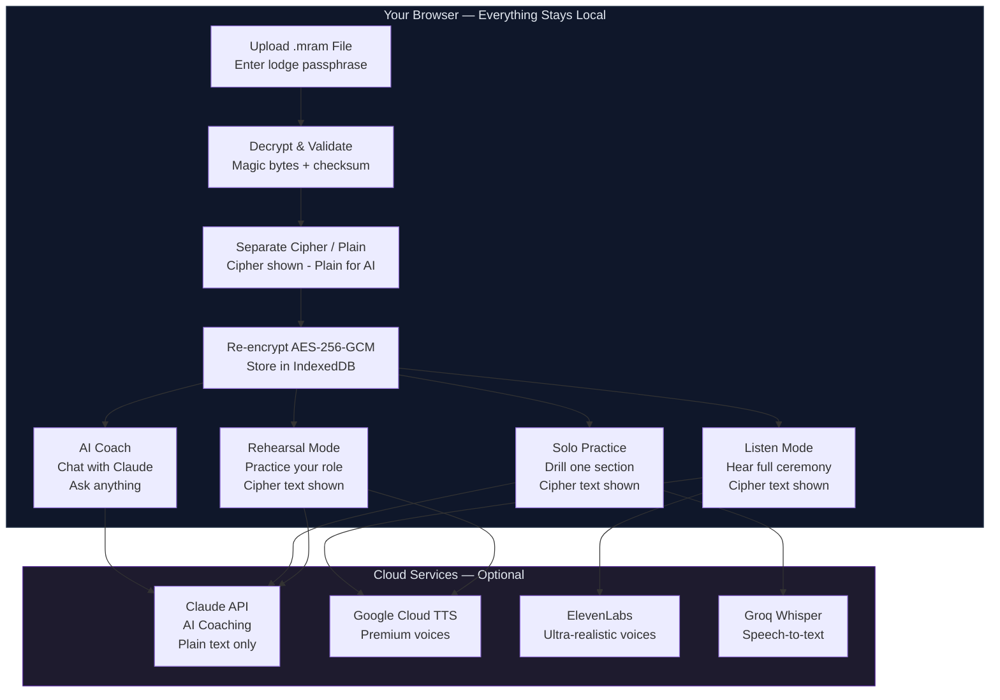

---

# Getting Started

---

## 1. Install the App

> **You'll need:** Node.js 18+ and an Anthropic API key ([get one here](https://console.anthropic.com/))

```bash
git clone https://github.com/mcleods777/masonic-ritual-ai-mentor.git
cd masonic-ritual-ai-mentor
npm install
cp .env.example .env
```

Add your API key to `.env`:

```
ANTHROPIC_API_KEY=sk-ant-your-key-here
```

Launch:

```bash
npm run dev
```

> Open **http://localhost:3000** — you're up and running.

---

## 2. Upload Your Ritual

> **Your lodge secretary provides the `.mram` file and passphrase.**

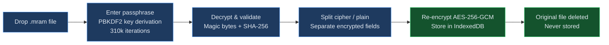

> **Cipher vs. Plain Text**
>
> **Cipher:** `B. S.W., p. t. s. y. t. a. p. a. M.`
> **Plain:** `Brother Senior Warden, proceed to satisfy yourself that all present are Masons.`
>
> You always see cipher text on screen. Plain text is only used behind the scenes for AI coaching and accuracy scoring.

---

---

# Practice Modes

---

## Solo Practice

> **Drill one section at a time until it's perfect.**

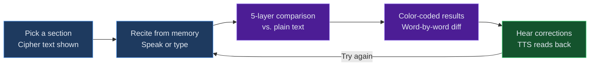

**How it works:**

1. Select a section from the dropdown (e.g., "Opening the Lodge")
2. Cipher text appears on screen as your reference
3. Tap the mic or type your lines from memory
4. Hit **Check** — see instant, color-coded feedback

**Reading Your Score**

| Color | What It Means |
|-------|--------------|
| `Green` | **Correct** — nailed it |
| `Red` | **Wrong** — different word |
| `Blue` | **Phonetic match** — right word, speech recognition spelled it differently ("rite" vs "right") |
| `Yellow` | **Fuzzy match** — close enough (minor variation) |
| `Gray` | **Missing** — you skipped this word |

> **How the scoring works — 5-Layer Comparison Pipeline:**

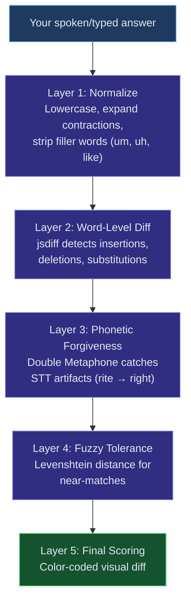

After checking, tap the speaker icon to **hear the correct version** read aloud.

---

## Listen Mode

> **Hear the full ceremony performed with unique AI voices for every officer.**

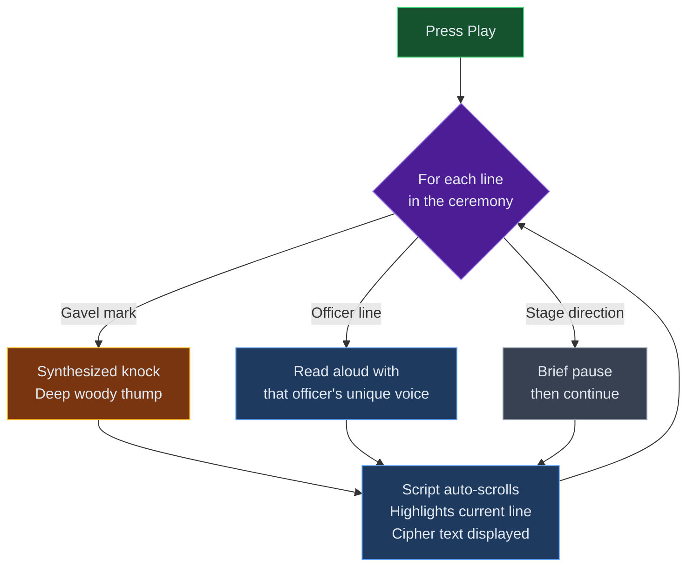

**Officer voices:**

| Officer | Voice Character |
|---------|----------------|
| Worshipful Master | Deep, authoritative |
| Senior Warden | Clear, measured |
| Junior Warden | Mid-range, steady |
| Senior Deacon | Slightly brighter |
| Junior Deacon | Crisp, distinct |
| Chaplain | Deepest, slowest |
| Tyler | Higher, distinct |

Use **Pause / Resume** anytime. Gavel marks produce synthesized knock sounds. Stage directions appear on screen but aren't spoken.

---

## Rehearsal Mode

> **Practice your role while AI reads everyone else's parts.**

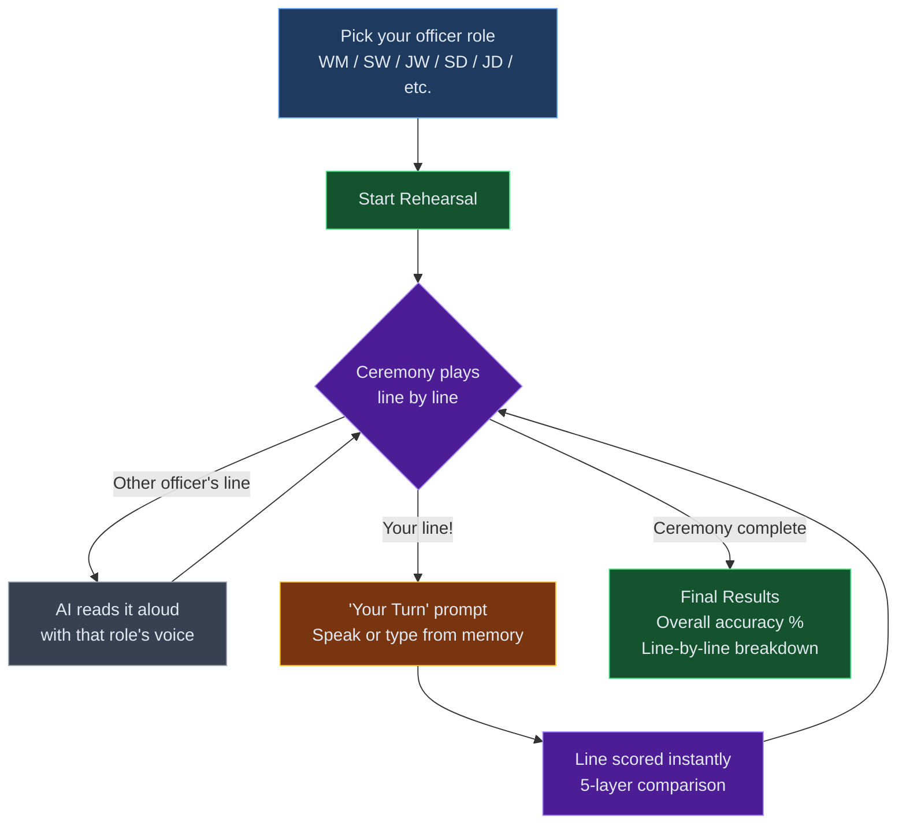

> This is the closest thing to rehearsing with your lodge — without needing anyone else to be there.

---

## AI Ritual Coach

> **Chat with Claude about your specific ritual.**

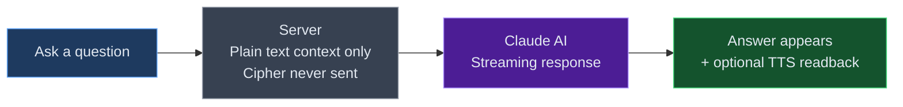

Ask anything:
- *"What does the Senior Warden say after the Worshipful Master's opening?"*
- *"Quiz me on the Junior Deacon's lines in the opening"*
- *"Explain the significance of the first section"*

**Choose your model:**

| Model | Best For |
|-------|---------|
| **Haiku** | Quick questions, fast responses |
| **Sonnet** | Balanced speed and depth |
| **Opus** | Complex questions, detailed explanations |

> **Privacy:** Only plain text is sent to Claude. Cipher text never leaves your device. Anthropic does not train on API data.

> **Masonic Safety:** The AI will **never** reveal grips, passwords, or modes of recognition. This is enforced at the system prompt level.

---

---

# Voice & Speech Setup

---

## Text-to-Speech Engines

Pick the voice quality that works for you:

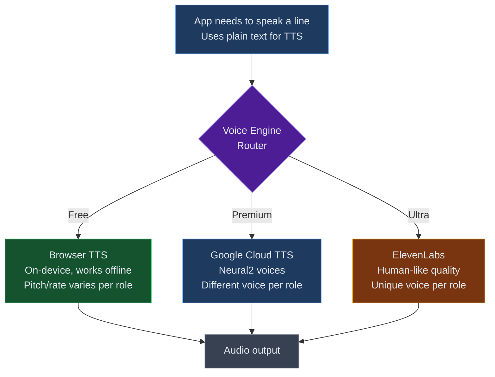

| Engine | Quality | Cost | Setup |
|--------|---------|------|-------|
| **Browser TTS** | Good | Free | None — works out of the box |
| **Google Cloud TTS** | Premium | Pay-per-use | API key required |
| **ElevenLabs** | Ultra-realistic | Pay-per-use | API key required |

### Setting Up Google Cloud TTS

1. Open [Google Cloud Console](https://console.cloud.google.com/)
2. Enable **Cloud Text-to-Speech API**
3. Go to **APIs & Services** then **Credentials** — create an API key
4. Add to `.env`:

```
GOOGLE_CLOUD_TTS_API_KEY=your-key-here
```

5. Restart the app

### Setting Up ElevenLabs

1. Sign up at [elevenlabs.io](https://elevenlabs.io/)
2. Copy your API key from **Profile**
3. Add to `.env`:

```
ELEVENLABS_API_KEY=your-key-here
```

4. Restart the app

---

## Speech-to-Text

| Engine | Accuracy | Setup |
|--------|----------|-------|
| **Browser Speech API** | Good for general speech | None — built into Chrome/Edge |
| **Groq Whisper** | Excellent — trained with Masonic vocabulary hints | API key required |

### Setting Up Groq Whisper

> **Recommended** if you find browser speech recognition stumbling on Masonic terms.

1. Sign up at [console.groq.com](https://console.groq.com/)
2. Create an API key
3. Add to `.env`:

```
GROQ_API_KEY=your-key-here
```

4. Restart the app

---

---

# Creating .mram Files

---

> **For lodge secretaries** or anyone who needs to build ritual files from scratch.

## Input Format

Create a markdown file where each spoken line appears **twice** — cipher first, then plain:

```markdown
### Opening the Lodge

WM: * Bro. S.W., p. t. s. y. t. a. p. a. M.
WM: * Brother Senior Warden, proceed to satisfy yourself that all present are Masons.

SW: * Bros. S. & J.D., p. t. s. y. t. a. p. a. M.
SW: * Brothers Senior & Junior Deacons, proceed to satisfy yourselves that all present are Masons.
```

## Format Rules

| Element | Syntax | Example |
|---------|--------|---------|
| **Section heading** | `### Title` | `### Opening the Lodge` |
| **Speaker line** | `ROLE: text` | `WM: Brother Senior Warden...` |
| **Gavel mark** | `*` after colon | `WM: * Brother Senior...` |
| **Stage direction** | `(parentheses)` | `(Senior Deacon rises)` |
| **Line pairing** | Cipher first, plain second | See example above |

## The .mram File Structure

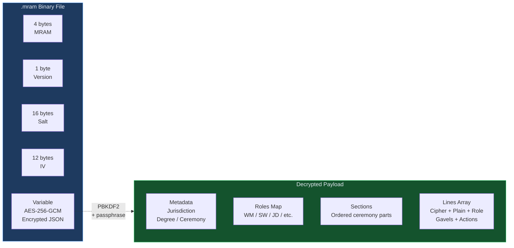

## Build Command

```bash
npx tsx scripts/build-mram.ts input.md output.mram "YourLodgePassphrase"
```

Share the `.mram` file with lodge members. They'll need the passphrase to open it.

---

---

# Deployment

---

## Vercel (Recommended)

| Step | Action |
|------|--------|
| **1** | Push code to GitHub |
| **2** | Import repo at [vercel.com](https://vercel.com/) |
| **3** | Add environment variables in project settings |
| **4** | Deploy — Vercel handles the rest |

**Required env vars:**

| Variable | Required? |
|----------|-----------|
| `ANTHROPIC_API_KEY` | Yes |
| `GOOGLE_CLOUD_TTS_API_KEY` | No |
| `ELEVENLABS_API_KEY` | No |
| `GROQ_API_KEY` | No |

## Self-Hosting

```bash
npm run build
npm start
```

Runs on port 3000 as a standard Next.js 16 application.

---

---

# Privacy & Security

---

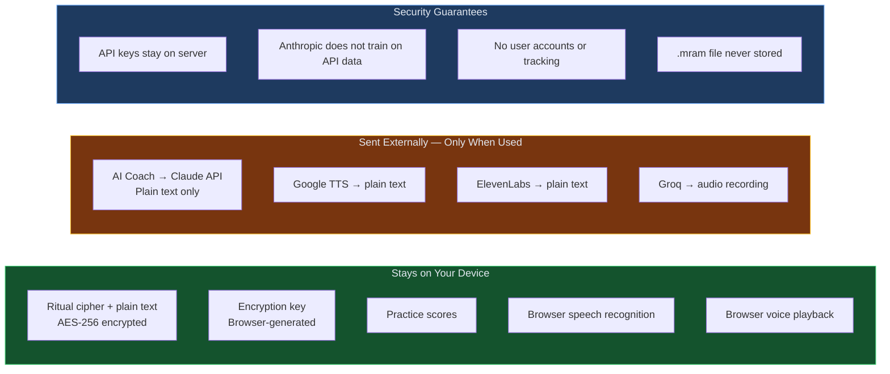

## What Stays on Your Device

| Data | Protection |
|------|-----------|
| Ritual cipher + plain text | AES-256-GCM encrypted, separate fields in IndexedDB |
| Encryption key | Generated by your browser, never transmitted |
| Practice scores | Local browser storage only |
| Browser speech recognition | Processed entirely on-device |
| Browser voice playback | Processed entirely on-device |

## What Goes to the Cloud (Only When Used)

| Service | What's Sent | Data Policy |
|---------|------------|-------------|
| Claude API (AI Coach) | Plain text only, never cipher | Anthropic does not train on API data |
| Google Cloud TTS | Plain text for speech synthesis | Google Cloud data processing terms |
| ElevenLabs TTS | Plain text for speech synthesis | ElevenLabs data processing terms |
| Groq Whisper | Audio recording for transcription | Groq data processing terms |

## Security Guarantees

- API keys are server-side only — never exposed to the browser
- PBKDF2 key derivation with **310,000 iterations** (OWASP 2023 standard)
- AES-256-GCM encryption for all stored data
- The `.mram` file is **never stored** — only re-encrypted data is kept
- **No user accounts, no tracking, no analytics**

---

---

# Tech Stack

---

## Architecture

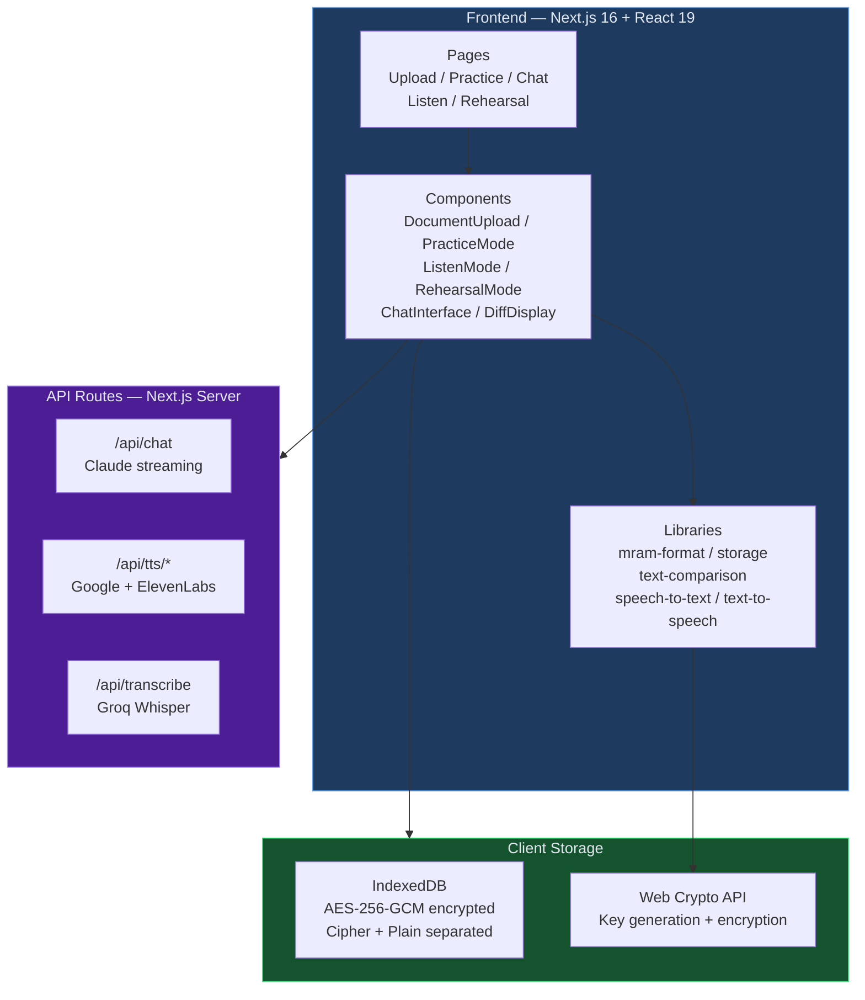

| Layer | Technology |
|-------|-----------|
| **Frontend** | Next.js 16 (App Router), React 19, TypeScript |
| **Styling** | Tailwind CSS v4 |
| **AI / LLM** | Claude (Haiku / Sonnet / Opus) via Vercel AI SDK |
| **Speech-to-Text** | Web Speech API + Groq Whisper |
| **Text-to-Speech** | Browser TTS + Google Cloud Neural2 + ElevenLabs |
| **Text Comparison** | jsdiff + Double Metaphone + Levenshtein distance |
| **Encryption** | AES-256-GCM + PBKDF2 (310k iterations) |
| **Local Storage** | IndexedDB with Web Crypto API |
| **Audio Effects** | Web Audio API (synthesized gavel knocks) |
| **Ritual Format** | `.mram` custom encrypted binary |

---

---

# Troubleshooting

---

## "Decryption failed" on upload

- Double-check your lodge passphrase — it's **case-sensitive**
- Ensure the `.mram` file wasn't corrupted during transfer
- Verify you have the right file for your jurisdiction/degree

## Speech recognition not working

- Use **Chrome** or **Edge** for best Web Speech API support
- Grant microphone permission when prompted
- Poor accuracy? Set up **Groq Whisper** for Masonic vocabulary support

## No sound in Listen / Rehearsal mode

- Check device volume and mute settings
- Try switching voice engines (Browser TTS, Google, ElevenLabs)
- Some browsers block autoplay — click a button first to allow audio

## AI Coach not responding

- Verify `ANTHROPIC_API_KEY` in `.env` is correct
- Check key validity at [console.anthropic.com](https://console.anthropic.com/)
- Restart the dev server after any `.env` change

## Voice engines not showing up

- Confirm the API key for that engine is in `.env`
- Restart the dev server (`npm run dev`)
- Check the browser console (F12) for API errors

---

---

# FAQ

---

**Can I use this on my phone?**
Yes. Fully responsive with mobile-optimized navigation. Works in any modern mobile browser.

**Does the AI store my ritual text?**
No. Anthropic does not train on API data. Text is sent only during active chat sessions and is not retained.

**Can I practice offline?**
Solo Practice with Browser TTS works fully offline. AI Coach and cloud TTS/STT need internet.

**What degrees are supported?**
Any ceremony formatted as an `.mram` file. The app is ceremony-agnostic.

**How do I share with my lodge?**
Deploy to Vercel (free tier works), share the URL. Each member uploads the same `.mram` file with the lodge passphrase. No accounts needed.

**Is my data safe?**
Yes. AES-256-GCM encryption, PBKDF2 key derivation (310k iterations), no server-side storage, no tracking. Your ritual stays in your browser.
