# Masonic Ritual AI Mentor

## Your Private, Voice-Driven Practice Companion

Upload your encrypted ritual file. Practice solo, listen to full ceremonies, rehearse your role with AI officers, and get instant word-by-word feedback — all while keeping your ritual secure with military-grade encryption.

---

## App Overview

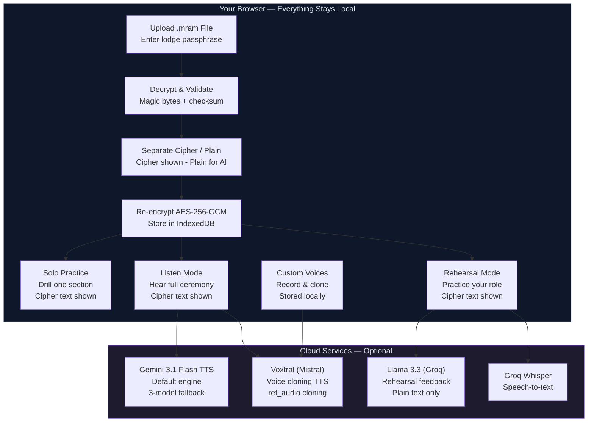

---

# Getting Started

---

## 1. Install the App

> **You'll need:** Node.js 18+ and a Groq API key ([get one free here](https://console.groq.com/)). Everything else is optional.

```bash
git clone https://github.com/mcleods777/masonic-ritual-ai-mentor.git
cd masonic-ritual-ai-mentor
npm install
cp .env.example .env
```

Add your API keys to `.env`:

```
# Required — AI feedback + speech-to-text
GROQ_API_KEY=gsk_your-key-here

# TTS engines — Gemini is the default; rest are fallbacks or alternatives
GOOGLE_GEMINI_API_KEY=           # Gemini 3.1 Flash TTS — default playback engine
MISTRAL_API_KEY=                 # Voxtral — voice cloning
DEEPGRAM_API_KEY=                # Aura-2 — fast, natural
ELEVENLABS_API_KEY=              # Premium — ultra-realistic
GOOGLE_CLOUD_TTS_API_KEY=        # Neural2 voices
KOKORO_TTS_URL=                  # Self-hosted, free
```

Launch:

```bash
npm run dev
```

> Open **http://localhost:3000** — you're up and running.

---

## 2. Upload Your Ritual

> **Your lodge secretary provides the `.mram` file and passphrase.**

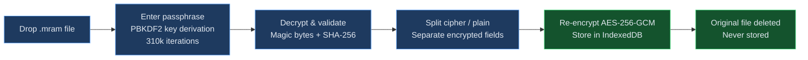

> **Cipher vs. Plain Text**
>
> **Cipher:** `B. S.W., p. t. s. y. t. a. p. a. M.`
> **Plain:** `Brother Senior Warden, proceed to satisfy yourself that all present are Masons.`
>
> You always see cipher text on screen. Plain text is only used behind the scenes for AI feedback and accuracy scoring — never shown, never displayed.

---

---

# Practice Modes

---

## Solo Practice

> **Drill one section at a time until it's perfect.**

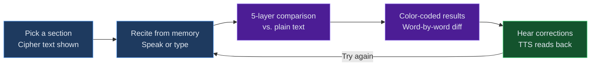

**How it works:**

1. Select a section from the dropdown (e.g., "Opening the Lodge")
2. Cipher text appears on screen as your reference
3. Tap the mic or type your lines from memory
4. Hit **Check** — see instant, color-coded feedback

**Reading Your Score**

| Color | What It Means |
|-------|--------------|
| `Green` | **Correct** — nailed it |
| `Red` | **Wrong** — different word |
| `Blue` | **Phonetic match** — right word, speech recognition spelled it differently ("rite" vs "right") |
| `Yellow` | **Fuzzy match** — close enough (minor variation) |
| `Gray` | **Missing** — you skipped this word |

> **How the scoring works — 5-Layer Comparison Pipeline:**

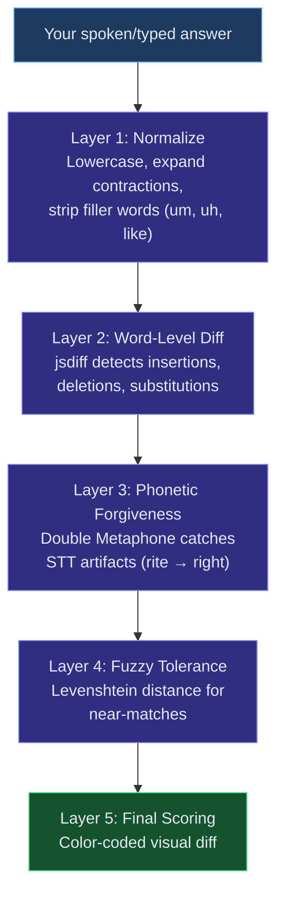

After checking, tap the speaker icon to **hear the correct version** read aloud.

---

## Listen Mode

> **Hear the full ceremony performed with unique AI voices for every officer.**

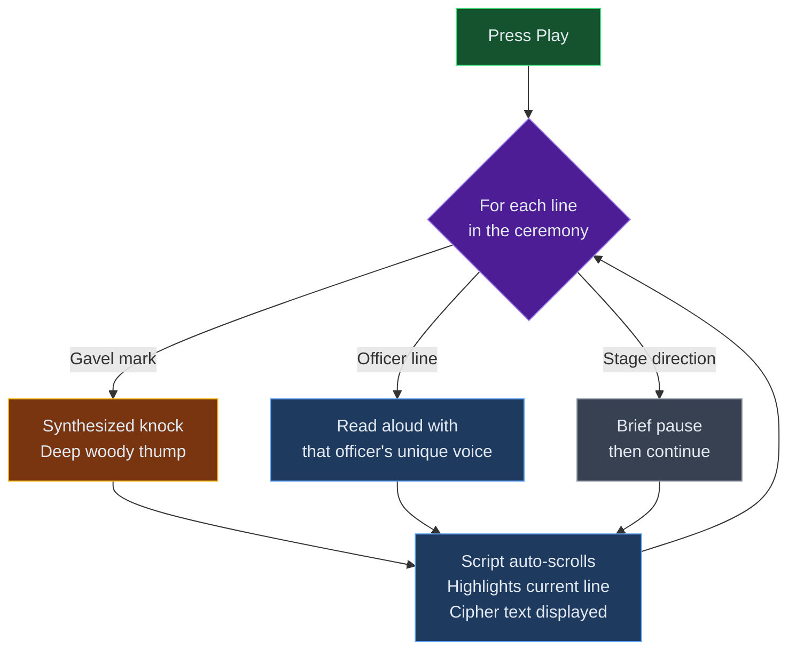

**Officer voices (Gemini 3.1 Flash — default engine):**

| Officer | Voice | Character |
|---------|-------|-----------|
| Worshipful Master | Alnilam | Deep, authoritative |
| Senior Warden | Charon | Clear, measured |
| Junior Warden | Algenib | Mid-range, steady |
| Senior Deacon | Fenrir | Smooth, warm |
| Junior Deacon | Crisp, distinct | |
| Chaplain | Reverent, steady | |
| Tyler | Resonant, laid-back | |

Use **Pause / Resume** anytime. Gavel marks produce synthesized knock sounds. Stage directions appear on screen but aren't spoken.

---

## Rehearsal Mode

> **Practice your role while AI reads everyone else's parts.**

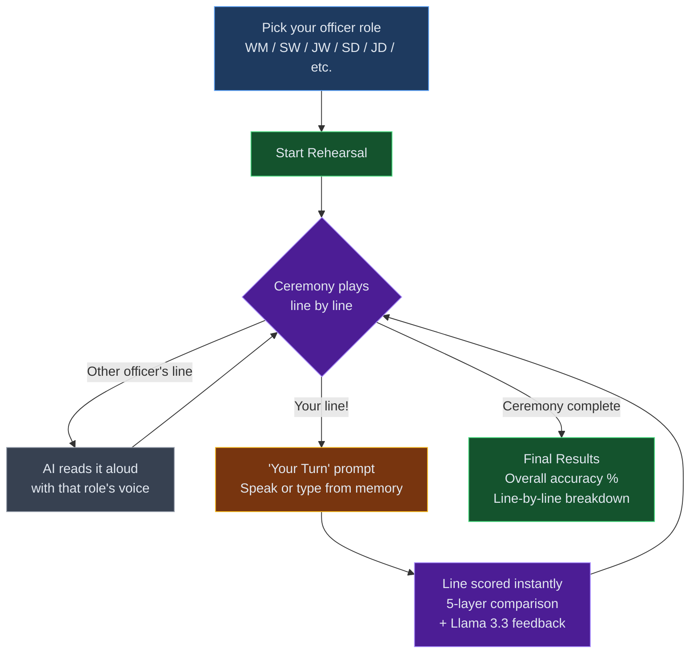

> This is the closest thing to rehearsing with your lodge — without needing anyone else to be there.

After each line, Llama 3.3 on Groq streams short feedback on what you missed and why. Only **plain text** is ever sent — cipher text never leaves your device, and grips/passwords/modes of recognition are never part of the corpus the AI sees.

---

## Custom Voice Cloning

> **Record a brother's voice once. Hear him read lines for rehearsal.**

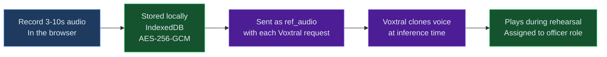

**How to clone a voice:**

1. Go to the **Voices** page
2. Pick an officer role
3. Tap **Record** and read a 10-second prompt (prompts are generic prose, no ritual content)
4. Name it ("Brother McLeod - WM") and save
5. Assign to one or more officer roles

The app ships with **15 default Voxtral character voices** as an unassigned fallback pool. When Gemini is throttled, Voxtral steps in using whatever voices you've assigned, or falls through to the default pool. Record your own voices to personalize; leave them blank and the defaults handle it.

Export/import voice profiles as JSON for backup and cross-device transfer.

---

---

# Voice & Speech Setup

---

## Text-to-Speech Engines

Seven TTS engines. Gemini is the default; the rest are fallbacks or alternatives.

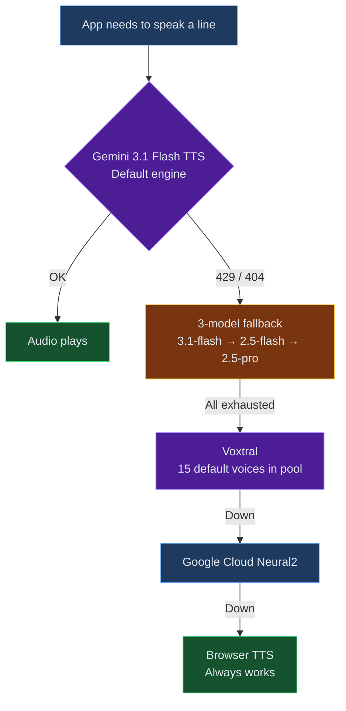

| Engine | Type | Voices | Cost |
|--------|------|--------|------|
| **Gemini 3.1 Flash TTS** *(default)* | Cloud, expressive | Per-role male voices (Alnilam, Charon, etc.) with prompt-tag direction | Preview pricing |
| **Voxtral (Mistral)** | Cloud + voice cloning | Clone any voice from 3s audio; 15 default character voices in pool | ~$0.016/1K chars |
| **ElevenLabs** | Cloud | 10 distinct male voices | Premium |
| **Deepgram Aura-2** | Cloud | 7 distinct voices (Zeus, Orion, etc.) | Pay-per-use |
| **Google Cloud TTS** | Cloud | Neural2 voices with pitch control | Pay-per-use |
| **Kokoro** | Self-hosted | Multiple voices, free | Free (self-hosted) |
| **Browser** | Built-in | Pitch/rate differentiation | Free |

### Setting Up Gemini (default)

1. Create a project at [Google AI Studio](https://aistudio.google.com/)
2. Create an API key
3. Add to `.env`:

```
GOOGLE_GEMINI_API_KEY=AIza-your-key-here
```

4. Optional — override the fallback chain at runtime:

```
GEMINI_TTS_MODELS=gemini-3.1-flash-preview-tts,gemini-2.5-flash-preview-tts,gemini-2.5-pro-preview-tts
```

### Setting Up Voxtral (voice cloning)

1. Sign up at [console.mistral.ai](https://console.mistral.ai/)
2. Copy your API key
3. Add to `.env`:

```
MISTRAL_API_KEY=your-key-here
```

4. Record voices on the **Voices** page — zero-shot cloning works on the free tier.

### Setting Up the Rest

Add any of these keys to `.env` to enable them. Each engine shows up in the engine dropdown when its key is present.

```
DEEPGRAM_API_KEY=your-key-here            # Aura-2
ELEVENLABS_API_KEY=your-key-here          # Premium
GOOGLE_CLOUD_TTS_API_KEY=your-key-here    # Neural2
KOKORO_TTS_URL=http://localhost:8880      # Self-hosted
```

---

## Speech-to-Text

| Engine | Accuracy | Setup |
|--------|----------|-------|
| **Groq Whisper** | Excellent — trained with Masonic vocabulary hints | Required for cloud STT |
| **Browser Speech API** | Good for general speech | None — built into Chrome/Edge |

### Setting Up Groq Whisper

> **Recommended** if you find browser speech recognition stumbling on Masonic terms.

1. Sign up at [console.groq.com](https://console.groq.com/)
2. Create an API key
3. Add to `.env`:

```
GROQ_API_KEY=gsk_your-key-here
```

4. Restart the dev server

The same key powers both Whisper STT and Llama 3.3 rehearsal feedback.

---

---

# Creating .mram Files

---

> **For lodge secretaries** or anyone who needs to build ritual files from scratch.

## Input Format — Two Parallel Dialogue Files

The current recommended path uses two parallel markdown files: plain English and cipher. Speaker structure must match line-for-line.

**`rituals/{prefix}-dialogue.md` (plain):**

```markdown
### Opening the Lodge

WM: * Brother Senior Warden, proceed to satisfy yourself that all present are Masons.

SW: * Brothers Senior and Junior Deacons, proceed to satisfy yourselves that all present are Masons.
```

**`rituals/{prefix}-dialogue-cipher.md` (cipher):**

```markdown
### Opening the Lodge

WM: * B. S.W., p. t. s. y. t. a. p. a. M.

SW: * Bros. S. & J.D., p. t. s. y. t. a. p. a. M.
```

## Format Rules

| Element | Syntax | Example |
|---------|--------|---------|
| **Section heading** | `### Title` | `### Opening the Lodge` |
| **Speaker line** | `ROLE: text` | `WM: Brother Senior Warden...` |
| **Gavel mark** | `*` after colon | `WM: * Brother Senior...` |
| **Stage direction** | `[brackets]` or `(parentheses)` | `[Senior Deacon rises]` |
| **Per-line style tags** | `{prefix}-styles.json` sidecar | Optional — Gemini prompt-tag overrides |

## The .mram File Structure

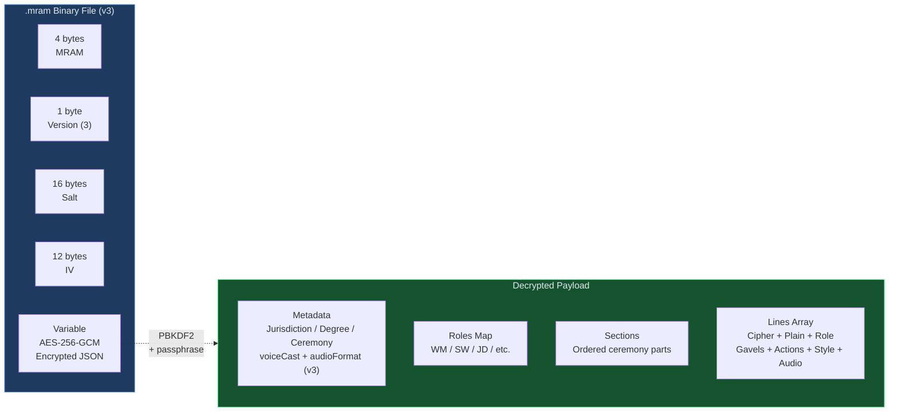

**Format version 3** adds optional per-line Opus audio bytes plus a `voiceCast` map so the client can skip the Gemini API entirely on playback.

## Build Command

```bash
npx tsx scripts/build-mram-from-dialogue.ts \
  rituals/{prefix}-dialogue.md \
  rituals/{prefix}-dialogue-cipher.md \
  rituals/{prefix}.mram
```

Passphrase is prompted interactively — never accepted on the command line.

## Build With Pre-Rendered Audio (recommended for pilot distribution)

```bash
GOOGLE_GEMINI_API_KEY=... \
npx tsx scripts/build-mram-from-dialogue.ts \
  rituals/ea-initiation-dialogue.md \
  rituals/ea-initiation-dialogue-cipher.md \
  rituals/ea-initiation.mram \
  --with-audio
```

The `--with-audio` flag renders every spoken line to Opus (32 kbps mono) via Gemini 3.1 Flash TTS and embeds the audio in the encrypted .mram payload. At playback time, the client plays these bytes directly — **zero Gemini API calls per Brother per rehearsal, ever**.

Requirements:
- `ffmpeg` in PATH (for Opus encoding)
- `GOOGLE_GEMINI_API_KEY` env var
- Your own Gemini quota (the script uses the 3-model fallback chain; on all-models-429 it sleeps until midnight PT and auto-resumes)

Per-line Opus bytes are cached at `~/.cache/masonic-mram-audio/` so interrupted runs resume cleanly. File size grows from ~50 KB to ~6 MB per ritual.

### Convenience wrapper — all 3 EA rituals

```bash
GOOGLE_GEMINI_API_KEY=... npx tsx scripts/bake-ea-rituals.ts
```

Runs ea-opening, ea-initiation, and ea-closing back-to-back with a single passphrase prompt. Use `BAKE_SKIP=ea-closing` to exclude specific rituals.

Share the `.mram` file with lodge members. They'll need the passphrase to open it.

---

---

# Deployment

---

## Vercel (Recommended)

| Step | Action |
|------|--------|
| **1** | Push code to GitHub |
| **2** | Import repo at [vercel.com](https://vercel.com/) |
| **3** | Add environment variables in project settings |
| **4** | Deploy — Vercel handles the rest |

**Required env vars:**

| Variable | Required? | Purpose |
|----------|-----------|---------|
| `GROQ_API_KEY` | Yes | Llama 3.3 feedback + Whisper STT |
| `GOOGLE_GEMINI_API_KEY` | Recommended | Default TTS engine |
| `MISTRAL_API_KEY` | Optional | Voxtral voice cloning |
| `DEEPGRAM_API_KEY` | Optional | Aura-2 TTS |
| `ELEVENLABS_API_KEY` | Optional | Premium TTS |
| `GOOGLE_CLOUD_TTS_API_KEY` | Optional | Neural2 TTS |

## Pilot Auth (Optional)

For lodges running a gated pilot, add magic-link auth:

```
LODGE_ALLOWLIST=brother1@example.com,brother2@example.com
RESEND_API_KEY=your-resend-key
MAGIC_LINK_FROM_EMAIL=pilot@yourlodge.org
MAGIC_LINK_BASE_URL=https://your-pilot-url.vercel.app
```

- Only emails on `LODGE_ALLOWLIST` receive sign-in links
- No passwords, no accounts beyond a session cookie
- Per-IP and per-email rate limiting on link issuance (5/hr per IP, 3/hr per email)
- Session cookie is good for 30 days; sign-in link is good for 24 hours

## Self-Hosting

```bash
npm run build
npm start
```

Runs on port 3000 as a standard Next.js 16 application.

---

---

# Privacy & Security

---

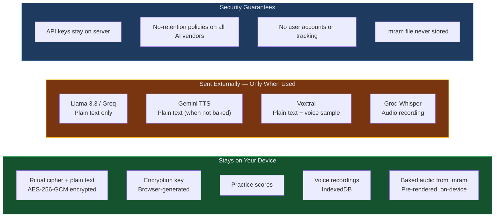

## What Stays on Your Device

| Data | Protection |
|------|-----------|
| Ritual cipher + plain text | AES-256-GCM encrypted, separate fields in IndexedDB |
| Encryption key | Generated by your browser, never transmitted |
| Practice scores | Local browser storage only |
| Voice recordings (Voxtral) | Encrypted IndexedDB, only sent with TTS requests |
| Pre-baked audio (baked .mram) | Played from file, never leaves the device |

## What Goes to the Cloud (Only When Used)

| Service | What's Sent | Data Policy |
|---------|------------|-------------|
| Groq (Llama 3.3) | Plain text only, never cipher | No-retention policy |
| Groq (Whisper) | Audio recording for transcription | No-retention policy |
| Google Gemini TTS | Plain text for speech synthesis | Google AI Studio data terms |
| Voxtral (Mistral) | Plain text + ref_audio sample | Mistral data processing terms |
| Google Cloud TTS | Plain text for speech synthesis | Google Cloud data processing terms |
| Deepgram / ElevenLabs | Plain text for speech synthesis | Vendor data processing terms |

## Security Guarantees

- API keys are server-side only — never exposed to the browser
- PBKDF2 key derivation with **310,000 iterations** (OWASP 2023 standard)
- AES-256-GCM encryption for all stored data
- The `.mram` file is **never stored** — only re-encrypted data is kept
- **No user accounts, no tracking, no analytics**
- Strict CSP, HSTS preload, `X-Frame-Options: DENY`, locked `Permissions-Policy` on every response
- Magic-link auth uses `x-vercel-forwarded-for` for trustworthy IP attribution on rate limits
- Grips, passwords, and modes of recognition are never in the corpus the AI sees

---

---

# Tech Stack

---

## Architecture

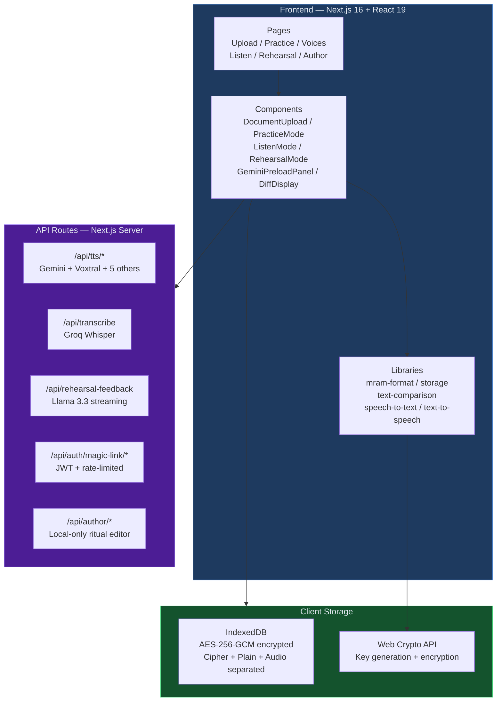

| Layer | Technology |
|-------|-----------|
| **Frontend** | Next.js 16 (App Router), React 19, TypeScript |
| **Styling** | Tailwind CSS v4 |
| **AI Feedback** | Llama 3.3 70B on Groq (streaming) |
| **Speech-to-Text** | Groq Whisper Large v3 + Browser Web Speech API |
| **Text-to-Speech** | Gemini 3.1 Flash TTS (default), Voxtral, ElevenLabs, Deepgram Aura-2, Google Cloud TTS, Kokoro, Browser |
| **Voice Cloning** | Voxtral (Mistral) via ref_audio zero-shot cloning |
| **Text Comparison** | jsdiff + Double Metaphone + Levenshtein distance |
| **Encryption** | AES-256-GCM + PBKDF2 (310k iterations) |
| **Local Storage** | IndexedDB with Web Crypto API |
| **Audio Effects** | Web Audio API (synthesized gavel knocks, WAV encoding) |
| **Ritual Format** | `.mram` custom encrypted binary (v3 — with embedded Opus audio) |
| **Auth** | Magic-link (JWT + per-IP/per-email rate limiting) for pilot allowlist |
| **Deployment** | Vercel Fluid Compute |

---

---

# Troubleshooting

---

## "Decryption failed" on upload

- Double-check your lodge passphrase — it's **case-sensitive**
- Ensure the `.mram` file wasn't corrupted during transfer
- Verify you have the right file for your jurisdiction/degree

## Speech recognition not working

- Use **Chrome** or **Edge** for best Web Speech API support
- Grant microphone permission when prompted
- Poor accuracy? Set up **Groq Whisper** for Masonic vocabulary support

## No sound in Listen / Rehearsal mode

- Check device volume and mute settings
- If your .mram was built with `--with-audio`, the audio is embedded — try re-uploading the file to make sure it loaded
- Switch voice engines from the dropdown (Gemini, Voxtral, Browser TTS, etc.)
- Some browsers block autoplay — click a button first to allow audio

## Rehearsal feedback not appearing

- Verify `GROQ_API_KEY` in `.env` is correct
- Check key validity at [console.groq.com](https://console.groq.com/)
- Restart the dev server after any `.env` change

## Gemini voices suddenly sound different

- Gemini TTS preview has a daily quota that resets at midnight Pacific Time
- When exhausted, the route falls back: 3.1-flash → 2.5-flash → 2.5-pro → Voxtral → Google Cloud → Browser
- If you hear a different voice, the fallback fired — add billing to your Gemini project or wait for reset
- Baked .mram files skip this path entirely (audio comes from the file, not the API)

## Voice engines not showing up

- Confirm the API key for that engine is in `.env`
- Restart the dev server (`npm run dev`)
- Check the browser console (F12) for API errors

---

---

# FAQ

---

**Can I use this on my phone?**
Yes. Fully responsive with mobile-optimized navigation. Install as a PWA from Safari (iOS) or Chrome (Android) for a native-app feel.

**Does the AI store my ritual text?**
No. Groq, Google Gemini, Mistral, Deepgram, ElevenLabs, and Google Cloud TTS all have no-retention policies. Text is sent only during active sessions and is not retained. For the pilot, baked .mram files skip the cloud entirely for playback — the audio is already on your device.

**Can I practice offline?**
Solo Practice with Browser TTS works fully offline. Baked .mram files play Listen and Rehearsal audio offline too. The only online-required features are Groq feedback and Whisper STT.

**What degrees are supported?**
Any ceremony formatted as an `.mram` file. The app is ceremony-agnostic. The `/author` page (local-only) is a side-by-side editor for lodge secretaries building or editing rituals.

**How do I share with my lodge?**
Deploy to Vercel (free tier works), share the URL. Distribute the `.mram` file separately (USB stick, direct message). Each member uploads the same `.mram` with the lodge passphrase. No accounts needed unless you want the pilot auth gate.

**Does the AI ever see grips, passwords, or modes of recognition?**
No. Those are not in the plain-text corpus. The AI only sees the plain text of ritual speech. The system prompt further enforces that it never generates or echoes recognition modes.

**Is my data safe?**
Yes. AES-256-GCM encryption, PBKDF2 key derivation (310k iterations), no server-side storage, no tracking. Your ritual stays in your browser. For the pilot, magic-link auth with per-IP/per-email rate limits keeps the allowlist gate tight.
