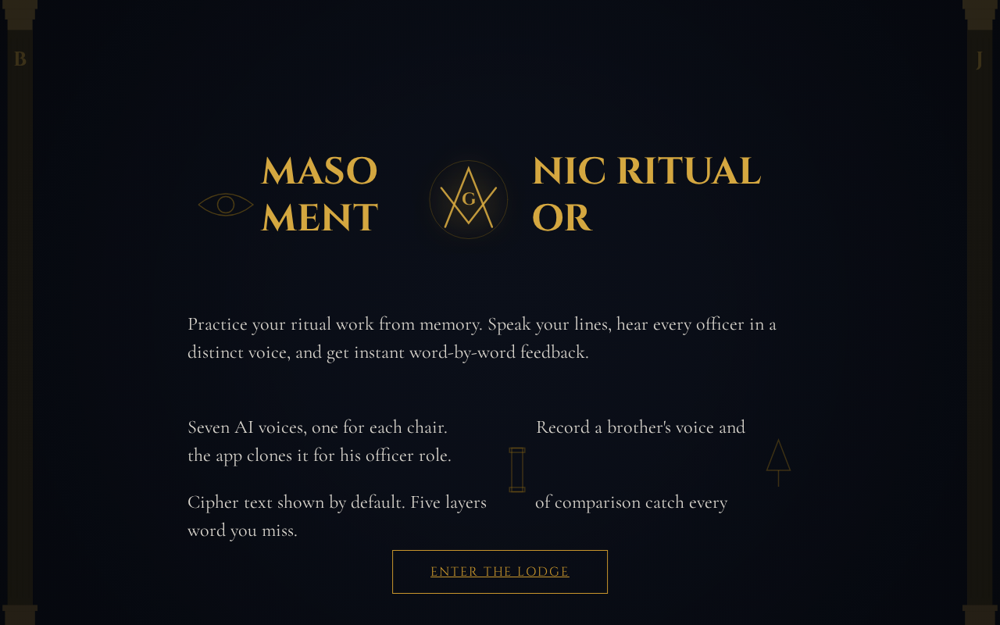
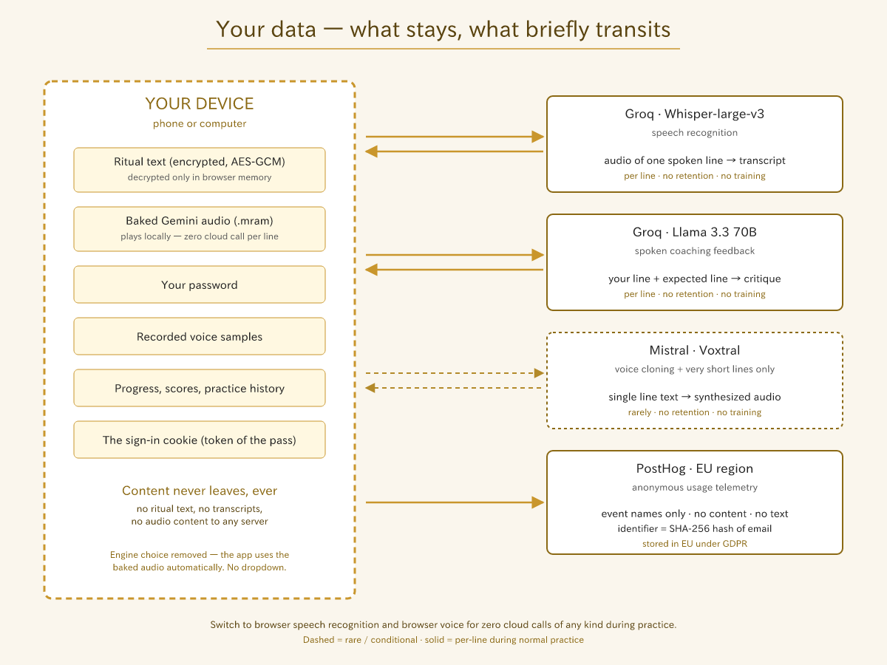
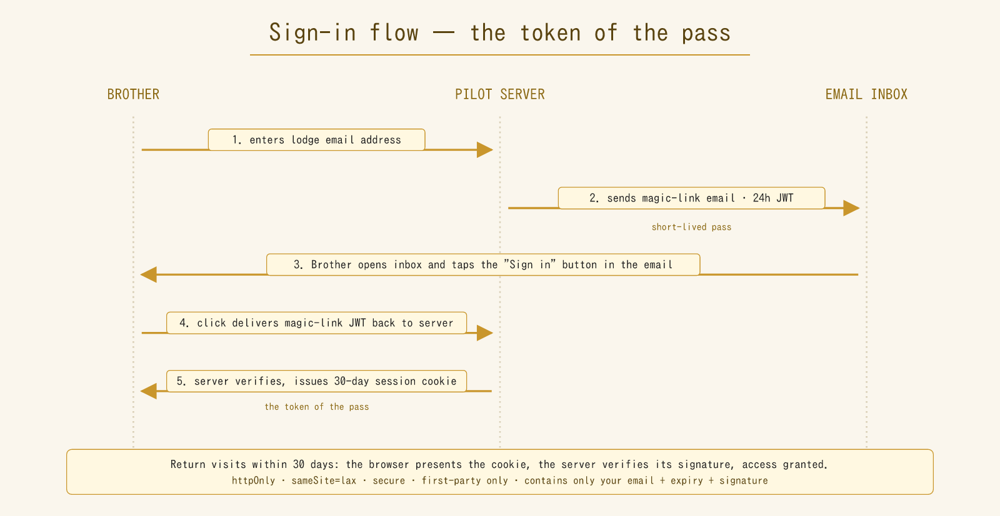
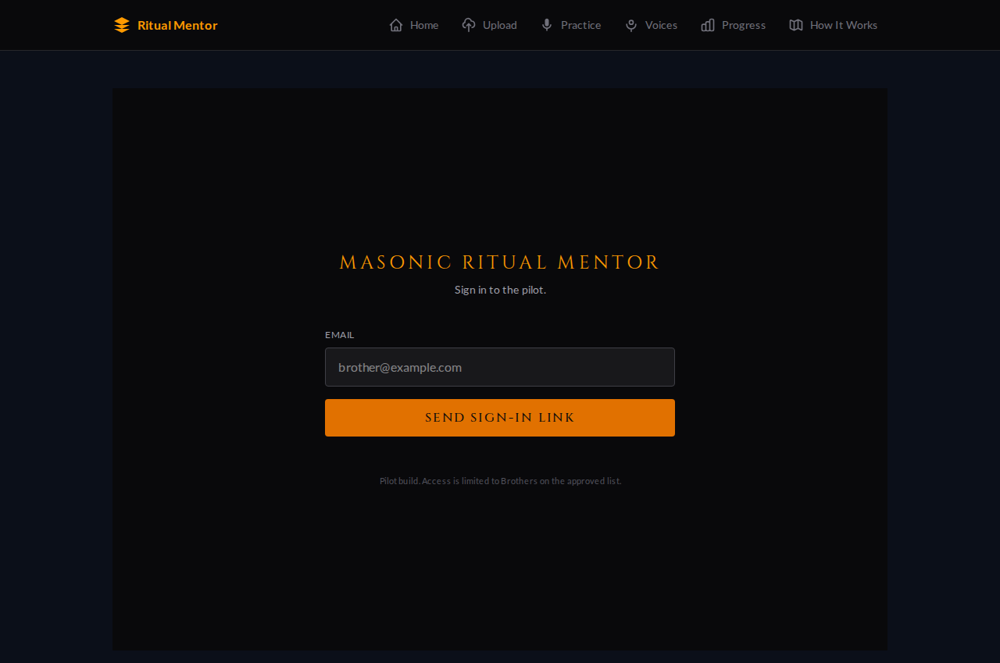
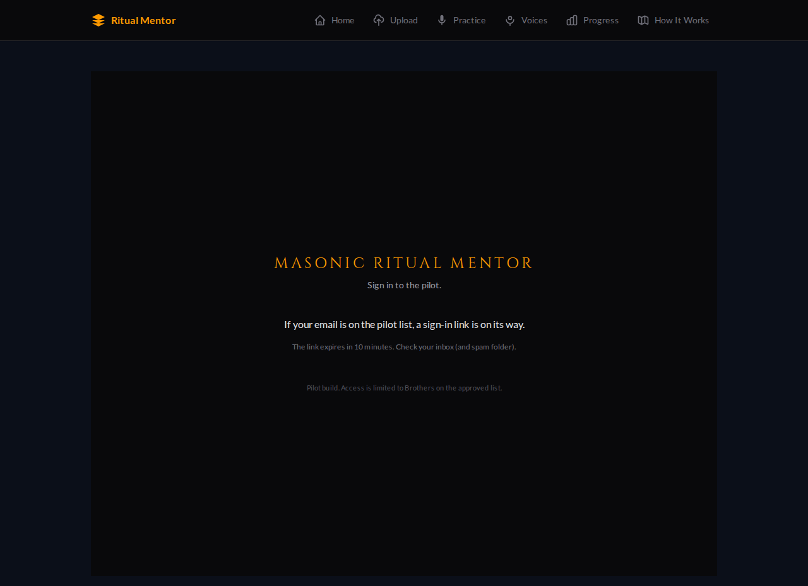
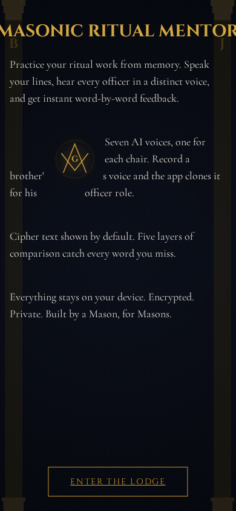
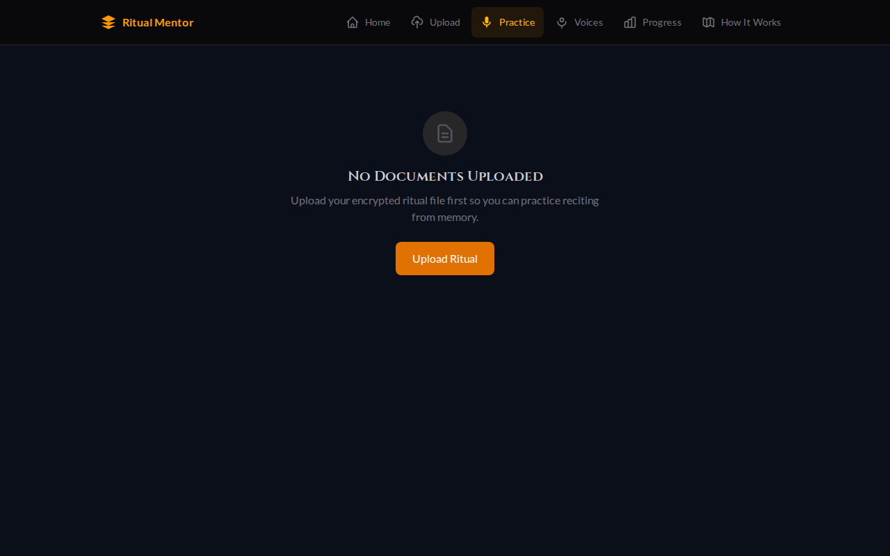

# Pilot invitation email

> **To send with images:** open `docs/pilot-email.html` in a browser,
> select-all (Ctrl/Cmd+A), copy (Ctrl/Cmd+C), and paste into Gmail's
> compose window. The six screenshots come through automatically because
> the repo is public.
>
> **To send as plain text:** copy the body below. The Markdown image
> references render correctly when reading this file on GitHub, but
> Gmail will not render them — use the HTML version for that.

**Subject:** Masonic Ritual Mentor — your pilot invitation

---

Brother,

You're being invited into the pilot for **Masonic Ritual Mentor**, an app
that lets you practice your ritual work from memory on your phone or
computer. You speak your lines, the app reads the other officers' parts in
distinct voices, and you get instant word-by-word feedback on what you
missed.

Everything runs privately. Your ritual file is encrypted, decrypted on your
own device, and never stored on a server.

## About the front page — why it looks the way it does

When you open the pilot URL, the first thing you see is a dark landing
page with a glowing square-and-compass that drifts across the screen while
several paragraphs of text flow around it — the words genuinely *reshape*
themselves around the symbol as it moves.

That is not a gimmick — and it is not something you have seen on a
website before, because until now it could not be done. For the entire
thirty-year history of the web, text has been trapped inside rectangles.
Paragraphs wrap around the invisible edges of a box, full stop. A narrow
CSS feature added around 2014 (`shape-outside`) let a paragraph hug the
edge of *one* static image, but nothing more — no multiple obstacles, no
moving obstacles, no real reflow.

The page is a live demo of a brand-new open-source text layout standard
called **Pretext**, released just days ago by an engineer at Midjourney.
Pretext is the first practical way to get real, dynamic, multi-obstacle
text reflow on the open web — text that genuinely recalculates its
shape in real time as objects drift, resize, or appear. It unlocks an
entire category of layout that was previously impossible outside of
print: magazine-grade typography, interactive fiction, games with
diegetic text, data-viz with inline narrative. Our landing page is one
of the earliest real-world uses of it outside the author's own demos.

Short YouTube explainer on what Pretext is and why it matters:

https://youtu.be/CUAuy5SWJcw?si=0WRv_QF8yfhyaYKn

Write-up in VentureBeat:

https://venturebeat.com/technology/midjourney-engineer-debuts-new-vibe-coded-open-source-standard-pretext-to

Full transparency: no brother asked me to put this on the front page. I
put it there as a flex. When I first read about Pretext, I wanted to
see if I could get it running inside the app within the hour — and I
was frankly amazed when I could. It has no bearing on the rehearsal
feature itself. It is there because it is beautiful, it is new, and
our lodge's pilot page gets to be one of the first places on the open
web to show it off.

## Under the hood — why this app is unique

Most dictation tools stumble the moment you use Masonic vocabulary. This
one was built for it. A quick summary of what's actually running.

### Speech recognition tuned for ritual

When you speak, the app sends your audio to **OpenAI Whisper-large-v3**
(running on Groq's hardware for near-instant response) with a vocabulary
hint that primes the model for ritual terms — *Worshipful Master*,
*Tyler*, *Jachin*, *Boaz*, *Fellowcraft*, and so on. If Whisper isn't
reachable, it falls back automatically to your browser's built-in
recognition.

### Seven voice engines, including expressive AI voices and voice cloning

Any of seven text-to-speech engines can read the ritual aloud:

- **Google Gemini 3.1 Flash TTS** *(default)* — Google's newest expressive
  voice model. Per-officer male voices with prompt-driven direction
  (gravely, reverent, commanding). When the daily quota fills up, the
  app silently falls through to two older Gemini models so playback
  keeps working.
- **Mistral Voxtral** — supports **zero-shot voice cloning**. Record a
  short sample of a brother speaking and the app will read *his*
  officer's lines in *his* voice. No paid "voice clone" tier required.
  Ships with 15 character voices in the pool as backup.
- **ElevenLabs** — twelve distinct male voices, one per officer chair.
- **Google Cloud Neural2** — per-role voice, pitch, and rate tuning so
  the Worshipful Master sounds deeper than the Tyler.
- **Deepgram Aura-2** — seven mythologically-named voices (Zeus, Orion,
  Arcas, and so on).
- **Kokoro** — a self-hosted option with no cloud dependency.
- **Browser built-in** — always works, even offline.

If a cloud engine is down or rate-limited, the app automatically falls
through the chain (Gemini → Voxtral → Google Cloud → browser) so you
never hit a dead end during practice.

### Five-layer feedback, not just text matching

When you finish a line, the app doesn't just compare your words to the
expected text character-by-character. It runs five layers:

1. **Normalization** — lowercase, expand contractions, strip filler words.
2. **Word-level diff.**
3. **Phonetic matching** — Double Metaphone plus a Masonic alias map, so
   *WM* and *Worshipful Master* count as the same thing.
4. **Fuzzy tolerance** — small typos or single-edit slips are forgiven.
5. **Scoring** — an accuracy percentage and a highlight of exactly which
   words gave you trouble.

After the diff, a large language model (Llama 3.3 70B via Groq) generates
a short spoken coaching response — brief, contextual, and streamed to
you as you listen.

### Coming soon — expressive TTS from Google and Microsoft

Two major new voice models land in the six-engine dropdown as the pilot
progresses. Both fix the one thing today's text-to-speech still gets
wrong for ritual work: *delivery.* A flat, evenly-paced reading is fine
for a shopping list — it is not fine for the gravitas of an obligation
or the cadence of a lecture.

- **Google Gemini 3.1 Flash TTS** (released April 2026). It accepts
  inline *audio tags* — short bracketed directions like `[slow, solemn]`
  or `[whispered]` — that steer style, pace, and emotion at any point
  mid-sentence. That means the ritual text itself can pre-mark the
  cadence shifts the work already calls for, and the voice engine will
  honor them. It currently sits at the top of the Artificial Analysis
  TTS quality leaderboard (Elo 1,211), supports 70+ languages, and
  watermarks every clip with SynthID.
- **Microsoft Azure Dragon HD / Neural HD 2.5** (rolling out early-to-mid
  2026). Microsoft's new HD line is LLM-based: the model reads the
  *meaning* of each line and adjusts emotional tone automatically —
  measured pause at a solemn passage, lift at a welcome, weight at a
  charge — without any manual markup at all. A unified model covering
  700+ voices, with wider availability and a significant price drop
  arriving in March 2026.

Both slot into the existing six-engine architecture. You will simply
see two new options appear in the voice-engine dropdown during the
pilot, and the ritual will start to *sound* like ritual.

## Your data — what leaves your device, and what doesn't

Privacy is not an afterthought in this app. It is the design.

### What stays on your device, always

- **The ritual text itself.** Encrypted with **AES-GCM** via the browser's
  Web Crypto API and stored in your device's local IndexedDB. Decrypted
  only in memory while you are practicing. Never written to disk
  unencrypted. **Never sent to any server, at any time, for any reason.**
- **Your password.** Used to derive the decryption key right there in
  your browser. Never transmitted anywhere.
- **Any voice samples you record** for the voice-cloning feature. Kept
  locally in IndexedDB.
- **Your progress, scores, and practice history.** Local only. No analytics.

### The sign-in cookie — the token of the pass

One small piece of data does stay on your device between visits: the
sign-in cookie. Think of it as the lodge's **token of the pass** — the
digital sign the app presents at the door each time you return, so you
do not have to repeat the magic-link ceremony every visit.

It contains exactly this:

- The email address you signed in with.
- The time it was issued.
- Its expiration (30 days from sign-in).
- A cryptographic signature proving the pilot server issued it.

Nothing else. No browsing history, no device fingerprint, no tracking
ID, no analytics, no shadow profile. It is not a third-party cookie —
it only exists on the pilot URL's own domain, and it is never shared
with any advertiser, tracker, or outside service.

Three technical safeguards keep it inert:

- **`httpOnly`** — no JavaScript running in your browser can read it.
  Only the pilot server sees it, only on requests to the pilot URL.
- **`sameSite=lax`** — the cookie is not sent with requests originating
  from other websites. A malicious page cannot trick your browser into
  handing it over.
- **`secure`** — it only travels over HTTPS, never in the clear.

You can delete the cookie from your browser's settings at any time to
sign yourself out. And if a brother ever loses a device, replying to
this email lets me rotate the server's signing key — that instantly
invalidates every outstanding token across the jurisdiction, the
emergency kill-switch.

### What briefly transits the cloud while you practice

Only these, only while you are actively rehearsing, and only as short
ephemeral snippets:

- **The audio of the line you just spoke** — sent to Groq's Whisper
  service to transcribe. A few seconds of audio per line.
- **The text of the line about to be spoken** — sent to whichever voice
  engine you have selected (Voxtral, ElevenLabs, Google, or Deepgram) to
  synthesize the sound. A single sentence at a time.
- **Your transcribed line and the expected line** — sent to Groq's Llama
  service for the spoken coaching feedback.

Each of these is a single round-trip per line, answered in under a
second, and the cloud service does not keep it. All four vendors — **Groq,
Mistral, Google Cloud, and Deepgram** — contractually guarantee no
retention and no training on request data. No one at those companies
sees or stores your ritual.

### For complete on-device privacy

If you want zero cloud round-trips of any kind, switch to these settings
on the rehearsal screen:

- **Speech engine:** *Browser* — uses your phone or computer's built-in
  speech recognition. Fully on-device.
- **Voice engine:** *Browser* — uses your phone or computer's built-in
  text-to-speech. Fully on-device.

With these two selected, **nothing — not audio, not text, not feedback —
ever leaves your device.** The voices are less natural and the
recognition is a little less accurate, but the privacy guarantee is
absolute.

## See the code for yourself

Everything I have described above is verifiable because the entire app
is **open source**. The full source code lives publicly on GitHub:

**https://github.com/mcleods777/Masonic-Ritual-AI-Mentor**

### What is GitHub?

GitHub is the standard public website where software developers publish
the source code for their programs. Think of it as a library shelf where
anyone in the world can pull down the "blueprints" of an app and read
them, line by line. If you are not a programmer it will look like a lot
of unfamiliar text — but the important point is that it is *there*, not
hidden behind a closed door.

Why that matters for this pilot:

- **The claims in this email are checkable.** Any tech-savvy brother —
  or any computer-science student he knows — can verify for himself that
  the ritual file is encrypted, that the sign-in cookie contains only
  what I said it does, and that no tracking or analytics pings exist
  anywhere in the code.
- **Nothing can be hidden.** Every change to the app is logged publicly
  with the author's name, the date, and the exact lines of code that
  changed. There is no private version of the app doing something
  different from the public one.
- **The documents you are reading came from there.** Both this email
  and the install guide live in the repository's `docs/` folder and can
  be read on GitHub directly.

If you want to poke around, start with the **README** at the top of the
repository page — that is the plain-English summary — and the **`docs/`
folder**, where the written materials live.

### The license — AGPL, and why it matters

The code is published under the **GNU Affero General Public License,
version 3** (AGPL-3.0). That is a deliberate choice, and it protects
the brothers who use this app. In plain terms:

- **Free of charge, free to use, free to study, free to modify, free to
  share.** Any brother, any lodge, any jurisdiction is welcome to take
  a copy.
- **It cannot be taken back.** Once the code is published under AGPL,
  no future owner — not me, not a company that might buy the project,
  not anyone — can relicense it as closed, proprietary software. The
  freedom is locked in.
- **Modifications stay open.** If another person or organization takes
  this code, changes it, and runs it on their own server for brothers
  to use, AGPL requires them to publish their modifications under the
  same license. There is no way to fork the app, quietly add tracking
  or advertising, and keep those changes private.
- **No warranty.** Standard for open-source licenses — the software is
  provided as-is.

The practical upshot for our lodge: the app you install today cannot
become a closed, proprietary product trying to extract fees or data
from brothers. If I ever became unable to maintain it, the code would
remain available for someone else to take up. If another jurisdiction
likes it, they can adopt it, and their improvements flow back to
everyone.

AGPL is the same license that covers Mastodon and Nextcloud — the
established, privacy-respecting open-source projects in that space. The
full license text is in the repository as `LICENSE`, or you can read it
at [gnu.org/licenses/agpl-3.0.html](https://www.gnu.org/licenses/agpl-3.0.html).

## The pilot URL

> **https://masonic-ritual-ai-mentor.vercel.app**

Please keep this address inside the pilot group.

---

# Install guide

What follows is the full install guide. It's also available in the repo at
`docs/INSTALL-GUIDE.md` with screenshots, if you'd rather read it there.

## Before you start — what you'll need

1. **Your lodge email address.** This is the email I've added to the
   approved list. If you're not sure whether you're on the list, reply to
   this email.
2. **Your encrypted ritual file (the `.mram` file).** I'll send this to
   you in a separate email, along with the password. It is not
   distributed through the app itself.
3. **The password for your ritual file.** Memorize it. Do not write it
   down next to the file.
4. **The pilot URL above.**

## Part 1 — Sign in (do this first on every device)

1. Open the pilot URL in your web browser. You'll land on the sign-in
   page:

   

2. Type your lodge email in the box and tap **SEND SIGN-IN LINK**.

3. You'll see a confirmation message:

   

   Check your inbox. Within a minute or so you should receive a message
   with subject **"Your sign-in link."** Check spam if you don't see it.

4. Open the email and tap the amber **Sign in** button inside it. This
   opens the app with you signed in.

5. You are now on the landing page (shown above). Tap **ENTER THE LODGE**.

The sign-in remembers you for 30 days on this device. The link inside the
email is only good for 24 hours — if you wait longer, just request a new
one.

## Part 2 — Install as an app (recommended but optional)

Once signed in, you can install the site as an app on your phone or
computer so it gets an icon on your home screen and opens in its own
window like a native app. You don't *have* to install — the site works in
any browser tab — but on the phone especially, installing is nicer.

### iPhone (Safari)

On mobile, the landing page looks like this:

1. On the landing page, tap the **Share** button (square with an arrow
   pointing up) at the bottom of Safari.
2. Scroll down and tap **Add to Home Screen**.
3. Confirm the name and tap **Add**.
4. Open **Ritual Mentor** from your Home Screen.

### Android (Chrome or Edge)

1. Tap the **⋮** menu in the top right.
2. Tap **Install app** (or **Add to Home screen** — wording varies).
3. Confirm **Install**.

### Desktop — Microsoft Edge

1. Click **⋯** → **Apps** → **Install this site as an app**. Confirm
   **Install**.

### Desktop — Google Chrome

1. Look at the right end of the address bar for a small monitor-with-arrow
   icon and click it; or
2. **⋮** menu → **Cast, save, and share** → **Install page as app**
   (wording varies by Chrome version).

### Desktop — Safari (Mac)

1. **File → Add to Dock**. Confirm **Add**.

## Part 3 — Load your ritual

1. In the app, go to the **Upload** screen.
2. Select your encrypted `.mram` file.
3. Enter the password when prompted. The file decrypts on your device and
   is never sent to any server.
4. You're now on the **Practice** screen. Until a ritual is loaded, it
   looks like this:

   

   After you load the ritual, select a role, press the microphone button,
   and begin reciting.

Your ritual file stays on this device. To use the app on a second device,
you load the `.mram` file there too.

## Privacy — how the app handles the work

- Your ritual file is encrypted. Without the password, it cannot be read.
- Decryption happens in your browser, on your device. The server never
  sees the decrypted ritual.
- The app never stores your ritual on any server, ever.
- When the app reads lines aloud or evaluates what you've said, small
  pieces of text and audio are sent briefly to voice/AI services
  (Voxtral, Google, Deepgram, Groq). These services have no-retention
  policies — they do not save or train on the data.

## Troubleshooting

**I didn't get the sign-in email.** Wait two minutes, check spam/
promotions. If you use iCloud Private Relay on iPhone, try disabling it
or use your real address. If five minutes pass with nothing, reply to
this email — your address may not be on the approved list yet.

**"Invalid link."** Sign-in links expire in 24 hours. Request a new one.

**No Install option.** Some browser versions don't offer it. The app
works fine in a plain browser tab — installation is optional.

**Ritual file won't decrypt.** Check the password carefully (it's
case-sensitive). If the file itself is corrupted, I'll re-send.

**AI voice or feedback isn't working.** Try a different voice engine from
the dropdown at the top of the rehearsal screen. If none of the cloud
engines work, fall back to the **Browser** voice — it's less natural but
always works.

---

Questions of any kind — reply to this email or call me directly. I can
add your email to the approved list, resend your ritual file, or walk
you through any of these steps by phone.

Sincerely and fraternally,

Shannon McLeod
Pilot Lead
